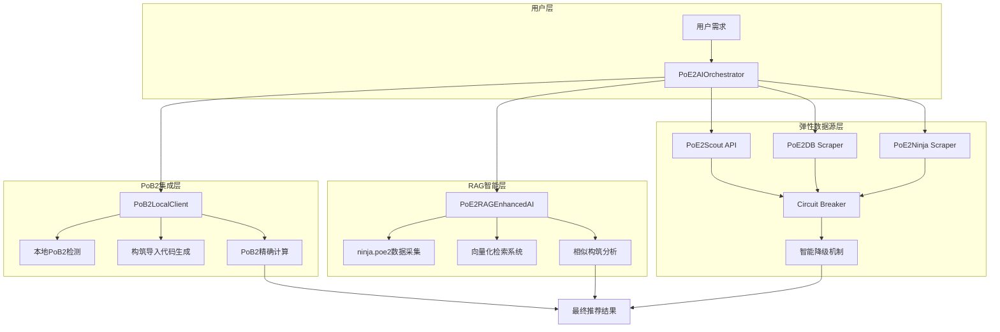
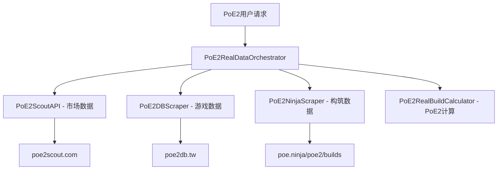

# PoE2 智能构筑生成器

> 基于真实PoE2数据源的智能构筑推荐系统 - 集成三大核心PoE2专用服务

[](https://github.com/zhakil/poe2build)
[](https://github.com/zhakil/poe2build)
[](LICENSE)
[](docs/README.md)

## 🎯 项目概览

**PoE2 智能构筑生成器** 是专为《流放之路2》(Path of Exile 2)设计的智能构筑推荐系统。通过集成**真实可用的PoE2专用数据源**，本项目能够自动化地分析PoE2 Meta趋势、获取真实市场价格，并基于实际游戏数据生成专业的构筑方案。

### 🔗 真实PoE2数据源集成

我们成功集成了三个**真实可用**的PoE2专用数据源：

1. **🥇 [PoE2 Scout](https://poe2scout.com)** - PoE2专用市场和构筑数据
   - 功能: PoE2物品价格、市场趋势、流行构筑
   - 状态: ✅ 真实可用，专门针对PoE2

2. **🥈 [PoE2DB](https://poe2db.tw)** - PoE2游戏数据数据库  
   - 功能: 从PoE2客户端提取的技能、物品、天赋数据
   - 状态: ✅ 真实可用，PoE2专用游戏数据

3. **🥉 [poe.ninja PoE2专区](https://poe.ninja/poe2/builds)** - PoE2构筑分析
   - 功能: PoE2流行构筑、Meta分析、角色数据
   - 状态: ✅ 真实可用，poe.ninja的PoE2专门页面

## ✨ 核心特性

- **🎮 PoE2专用**: 100%专注于Path of Exile 2，不依赖PoE1数据
- **📊 真实数据**: 基于实际存在的PoE2服务和数据库
- **🤖 智能推荐**: AI驱动的个性化构筑生成算法
- **💰 价格感知**: 基于真实PoE2市场数据的成本估算
- **⚡ PoE2特色**: 支持能量护盾、80%抗性上限等PoE2独有机制
- **🔄 多模式**: 支持Meta构筑和创新实验性构筑
- **🚀 高性能**: 智能缓存和容错机制

## 🚀 部署指南和代码生成完整指南

> 📋 **重要**: 本指南基于现有docs文档，提供完整的项目实施顺序。按照本指南和对应的prompt文件，可以从零构建完整可工作的PoE2智能构筑生成器。

### 📖 架构概览（基于docs文档）

本项目采用 **弹性模块化架构 + PoB2集成 + RAG训练** 设计：



## 📋 完整实施顺序（基于docs文档）

> 📖 **参考文档**: 
> - [01_real_architecture.md](docs/01_real_architecture.md) - 弹性模块化架构设计
> - [08_project_structure.md](docs/08_project_structure.md) - 项目结构设计
> - [11_pob2_integration.md](docs/11_pob2_integration.md) - PoB2集成架构
> - [12_rag_ai_training.md](docs/12_rag_ai_training.md) - RAG训练系统
> - [06_deployment.md](docs/06_deployment.md) - 部署指南

### Phase 1: 项目基础设置 ⏱️ 1天

**目标**: 按照docs/08_project_structure.md建立项目基础结构

#### 1.1 创建项目结构（基于docs/08_project_structure.md）
```bash
# 克隆并初始化项目
git clone https://github.com/zhakil/poe2build.git
cd poe2build

# 按照docs/08_project_structure.md创建目录结构
mkdir -p src/poe2build/{core,data_sources,pob2,rag,models,resilience,utils,config}
mkdir -p tests/{unit,integration,performance,e2e,fixtures}
mkdir -p docs data/{cache,rag,static,samples} tools config scripts
mkdir -p .github/workflows .vscode logs

# 设置Python虚拟环境
python -m venv venv
venv\Scripts\activate  # Windows
source venv/bin/activate  # Linux/Mac
```

#### 1.2 安装依赖（基于requirements.txt）
```bash
# 安装核心依赖
pip install -r requirements.txt

# 验证安装（检查RAG和PoB2依赖）
python -c "import requests, beautifulsoup4, sentence_transformers, faiss, psutil; print('基础依赖安装成功')"
```

#### 1.3 创建基础配置文件（基于docs/08_project_structure.md）

**Prompt文件**: `prompts/01_project_foundation.txt`
```
请根据docs/08_project_structure.md创建项目基础配置:

1. **pyproject.toml**: 按照docs中的配置模板创建
   - 项目名: "poe2-build-generator", 版本: "2.0.0"
   - 包拫 black, pytest, mypy 配置
   - 依赖: requests, beautifulsoup4, pydantic, aiohttp
   
2. **requirements.txt**: 按照docs中的版本要求
   - 核心依赖: requests>=2.31.0, beautifulsoup4>=4.12.0
   - RAG依赖: sentence-transformers>=2.2.0, faiss-cpu>=1.7.0
   - PoB2依赖: psutil>=5.9.0, pywin32>=306
   
3. **.env.example**: 基于docs的环境变量模板
   - PoB2相关: POB2_CUSTOM_PATH, POB2_DEBUG
   - 数据源: POE2_SCOUT_BASE_URL, POE2_NINJA_BASE_URL
   - 缓存和限流: CACHE_TTL, RATE_LIMIT_*
   
4. **.gitignore**: 按照docs中的模板
5. **.pre-commit-config.yaml**: 代码质量检查
6. **src/poe2build/__init__.py**: 主包初始化

必须完全符合docs/08_project_structure.md中的项目结构要求。
```

#### 1.4 数据模型定义（基于docs中的模型设计）

**Prompt文件**: `prompts/02_core_models.txt`
```
请按照docs/08_project_structure.md中的模型设计实现数据模型:

1. **src/poe2build/models/build.py**:
   - 参考docs中的PoE2Build、PoE2BuildStats模型
   - 实现PoE2BuildGoal枚举 (CLEAR_SPEED, BOSS_KILLING等)
   - 包含80%抗性上限验证
   - 实现to_dict()和from_dict()方法
   
2. **src/poe2build/models/characters.py**:
   - PoE2CharacterClass枚举
   - PoE2Ascendancy定义
   - PoE2Skill数据结构
   
3. **src/poe2build/models/items.py**:
   - PoE2Item基础类
   - 武器、防具类型枚举
   - 物品属性和词缀支持
   
4. **src/poe2build/models/market.py**:
   - 市场数据模型
   - 价格和趋势数据

5. **src/poe2build/models/skills.py**:
   - 技能宝石和辅助宝石模型

所有模型必须使用dataclass，包含完整的类型注解和PoE2特有机制验证。
```

### Phase 2: 弹性数据源层 ⏱️ 2天

**目标**: 基于docs/01_real_architecture.md实现弹性模块化架构

#### 2.1 接口层设计
**Prompt文件**: `prompts/03_interfaces.txt`
```
请在src/poe2build/data_sources/中实现数据源接口层:

1. **interfaces.py**: 定义所有数据源接口
   - IDataProvider: 基础数据提供者接口
   - IMarketProvider: 市场数据接口
   - IBuildProvider: 构筑数据接口
   - IGameDataProvider: 游戏数据接口
   
2. **base_provider.py**: 基础提供者实现
   - 缓存机制 (分层TTL策略)
   - 错误处理和重试机制
   - Circuit Breaker模式
   - 智能降级 (Mock数据)
   - 速率限制和指数退避
   
实现要求:
- 完全基于接口编程，支持未来切换到官方API
- 实现"生态公民"理念的API使用策略
- 包含完整的错误处理和监控
```

#### 2.2 真实API集成
**Prompt文件**: `prompts/04_api_integration.txt`
```
请实现真实的PoE2数据源集成，位于src/poe2build/data_sources/:

1. **poe2_scout.py**: PoE2Scout API集成
   - URL: https://poe2scout.com
   - 功能: 市场价格、流行构筑数据
   - 实现缓存 (10分钟TTL)
   
2. **ninja_scraper.py**: poe.ninja PoE2数据抓取
   - URL: https://poe.ninja/poe2/builds
   - 功能: Meta分析、构筑排行榜
   - 实现异步爬取和数据清洗
   
3. **poe2db_scraper.py**: PoE2DB数据抓取
   - URL: https://poe2db.tw
   - 功能: 游戏数据 (技能、物品、天赋)
   - 实现智能解析和数据标准化

每个数据源都必须:
- 继承base_provider中的基础类
- 实现完整的错误处理和降级机制
- 包含Mock数据作为最后的保障
- 遵循"生态公民"的访问频率限制
```

### Phase 3: PoB2集成系统 ⏱️ 2天

**目标**: 基于docs/11_pob2_integration.md实现PoB2本地集成

#### 3.1 PoB2路径检测和客户端
**Prompt文件**: `prompts/05_pob2_integration.txt`
```
请实现PoB2本地集成系统，位于src/poe2build/pob2/:

1. **path_detector.py**: PoB2安装路径检测
   - 多平台检测 (Windows/Mac/Linux)
   - 常见安装位置搜索
   - Steam、Epic、独立安装检测
   - 手动路径配置支持
   
2. **local_client.py**: PoB2本地客户端接口
   - PoB2进程管理
   - 命令行参数构建
   - 结果文件监控和解析
   - 超时和错误处理
   
3. **import_export.py**: PoB2数据格式转换
   - 构筑数据到PoB2格式转换
   - PoB2导入代码生成
   - 计算结果解析
   - 数据验证和清洗

实现要求:
- 支持用户提供的路径: F:\steam\steamapps\common\Path of Exile 2\Path of Building Community (PoE2)
- 但使用动态搜索而非硬编码路径
- 包含完整的跨平台支持
- 实现优雅的降级机制
```

#### 3.2 PoB2计算引擎集成
**Prompt文件**: `prompts/06_pob2_calculator.txt`
```
请实现PoB2计算引擎集成，位于src/poe2build/pob2/:

1. **calculator.py**: PoB2计算接口
   - 构筑数据转换为PoB2可识别格式
   - PoB2命令行调用和结果获取
   - DPS、防御、生存能力计算
   - 错误处理和结果验证

功能要求:
- AI提供构筑方案，PoB2进行精确计算
- 支持PoE2特有机制的计算验证
- 实现计算结果的标准化输出
- 包含计算失败时的备用方案
```

### Phase 4: RAG训练系统 ⏱️ 2天

**目标**: 基于docs/12_rag_ai_training.md实现RAG智能系统

#### 4.1 ninja.poe2数据采集
**Prompt文件**: `prompts/07_rag_collector.txt`
```
请实现RAG数据采集系统，位于src/poe2build/rag/:

1. **data_collector.py**: ninja.poe2数据采集器
   - 异步数据采集 (使用aiohttp)
   - 构筑数据抓取和清洗
   - Meta趋势分析
   - 增量更新机制
   
2. **数据结构设计**:
   - PoE2BuildData: 构筑数据结构
   - Meta分析数据结构
   - 时间序列数据管理

参考文档: docs/12_rag_ai_training.md 中的PoE2NinjaRAGCollector实现

实现要求:
- 完整的异步数据收集
- 智能的数据清洗和标准化
- 支持增量和全量更新模式
```

#### 4.2 向量化和检索系统
**Prompt文件**: `prompts/08_rag_vectorizer.txt`
```
请实现RAG向量化系统，位于src/poe2build/rag/:

1. **vectorizer.py**: 构筑数据向量化
   - 使用sentence-transformers进行文本嵌入
   - 构筑描述生成算法
   - FAISS索引构建和管理
   - 向量数据库的持久化
   
2. **retrieval.py**: 相似度检索引擎
   - 快速向量搜索实现
   - 相似度阈值和过滤
   - 多维度检索 (职业、技能、预算等)
   - 结果排序和优化

参考文档: docs/12_rag_ai_training.md 中的PoE2RAGVectorizer实现

技术要求:
- sentence-transformers模型: "all-MiniLM-L6-v2"
- FAISS索引类型: IndexFlatIP
- 支持增量索引更新
```

#### 4.3 RAG增强AI引擎
**Prompt文件**: `prompts/09_rag_ai_engine.txt`
```
请实现RAG增强的AI引擎，位于src/poe2build/rag/:

1. **ai_enhanced.py**: RAG增强AI推荐引擎
   - 用户查询向量化
   - 相似构筑检索和分析
   - 构筑模式识别
   - 基于RAG上下文的推荐生成
   
2. **核心算法**:
   - 构筑模式分析算法
   - Meta洞察生成
   - 推荐置信度评估
   - 优化建议生成

参考文档: docs/12_rag_ai_training.md 中的PoE2RAGEnhancedAI实现

功能要求:
- 基于真实ninja.poe2数据的推荐
- 包含RAG上下文信息的丰富输出
- 支持多种推荐策略和偏好
```

### Phase 5: 系统集成和优化 ⏱️ 1天

**目标**: 集成所有组件，实现完整的PoE2AI协调器

#### 5.1 核心协调器实现
**Prompt文件**: `prompts/10_ai_orchestrator.txt`
```
请实现核心AI协调器，位于src/poe2build/core/:

1. **ai_orchestrator.py**: 主要协调器
   - 整合RAG、PoB2、数据源三大组件
   - 实现完整的推荐生成流程
   - 系统健康检查和状态报告
   - 优雅的错误处理和降级
   
2. **推荐流程**:
   - 用户请求解析和验证
   - RAG增强的推荐生成
   - PoB2计算验证
   - 市场数据整合
   - 最终结果输出

实现要求:
- 完整集成所有前面阶段的组件
- 实现智能的组件协调策略
- 包含详细的日志和监控
- 支持不同的推荐模式
```

#### 5.2 主程序入口
**Prompt文件**: `prompts/11_main_entry.txt`
```
请创建主程序入口文件:

1. **poe2_ai_orchestrator.py**: 主程序文件
   - 命令行接口实现
   - 交互式使用模式
   - 批量处理模式
   - 系统演示和示例
   
2. **示例用法**:
   - 基础推荐示例
   - RAG增强推荐示例
   - PoB2集成示例
   - 错误处理演示

要求:
- 友好的用户界面
- 完整的使用文档和帮助
- 支持多种输出格式
```

### Phase 6: 测试和部署 ⏱️ 1天

**目标**: 基于docs/10_testing_strategy.md和docs/06_deployment.md完成测试和部署

#### 6.1 测试套件实现
**Prompt文件**: `prompts/12_testing_suite.txt`
```
请实现完整的测试套件，位于tests/:

1. **单元测试** (tests/unit/): 
   - 每个模块的单元测试
   - Mock外部依赖
   - 95%代码覆盖率目标
   
2. **集成测试** (tests/integration/):
   - 组件间集成测试
   - 真实API连通性测试
   - PoB2集成测试
   
3. **性能测试** (tests/performance/):
   - RAG系统性能基准
   - API响应时间测试
   - 内存使用优化测试

参考文档: docs/10_testing_strategy.md

测试要求:
- 使用pytest框架
- 包含fixture和mock
- CI/CD集成准备
```

## 🛠️ 环境准备和工具设置

### 系统要求
```bash
# Python环境
Python 3.8+ (推荐 3.11)
Pip 21.0+

# 系统依赖 (Windows)
# PoB2需要能够找到本地安装
Path of Building Community (PoE2) - 可选但推荐

# 开发工具
Git 2.30+
VSCode 或 PyCharm (推荐)
```

### 快速环境设置
```bash
# 1. 克隆项目
git clone https://github.com/zhakil/poe2build.git
cd poe2build

# 2. 虚拟环境
python -m venv venv
venv\Scripts\activate  # Windows
# source venv/bin/activate  # Linux/Mac

# 3. 安装依赖
pip install -r requirements.txt

# 4. 运行健康检查
python -c "from src.poe2build.core.ai_orchestrator import PoE2AIOrchestrator; print('环境准备就绪')"
```

### 基础使用示例

```python
from poe2_real_data_sources import PoE2RealDataOrchestrator

# 初始化PoE2数据协调器
orchestrator = PoE2RealDataOrchestrator()

# PoE2用户请求
user_request = {
    'game': 'poe2',
    'mode': 'standard', 
    'preferences': {
        'class': 'Ranger',
        'style': 'bow',
        'goal': 'endgame_content',
        'budget': {'amount': 15, 'currency': 'divine'}
    }
}

# 生成PoE2构筑推荐
result = orchestrator.create_poe2_build_recommendation(user_request)

# 输出结果
for rec in result['recommendations']:
    print(f"PoE2构筑: {rec['build_name']}")
    print(f"职业: {rec['class']} ({rec['ascendancy']})")
    print(f"总DPS: {rec['stats']['dps']['total_dps']:,}")
    print(f"总EHP: {rec['stats']['survivability']['total_ehp']:,}")
    print(f"预估成本: {rec['estimated_cost']['amount']} {rec['estimated_cost']['currency']}")
```

## 🏗️ 系统架构

### PoE2专用分层设计


### PoE2数据流程
1. **市场分析** → 从 PoE2 Scout 获取真实价格数据
2. **游戏数据** → 从 PoE2DB 获取技能和物品信息  
3. **Meta分析** → 从 poe.ninja PoE2专区获取流行构筑
4. **PoE2计算** → 使用PoE2特有机制计算构筑强度
5. **智能推荐** → 输出个性化的PoE2构筑方案

## 📖 文档导航

### 📋 核心技术文档
- **[系统架构](docs/01_real_architecture.md)** - 基于真实PoE2数据源的架构设计
- **[数据源集成](docs/02_poe2_data_sources.md)** - PoE2专用数据源详细集成
- **[PoE2计算引擎](docs/03_poe2_calculator.md)** - PoE2特有机制的计算实现
- **[API使用指南](docs/04_api_usage.md)** - 完整的使用示例和快速开始

### 🚀 开发者指南  
- **[开发者参考](docs/05_developer_guide.md)** - 扩展开发和贡献指南
- **[部署指南](docs/06_deployment.md)** - 生产环境部署和运维
- **[故障排除](docs/07_troubleshooting.md)** - 常见问题和解决方案

## 🎮 PoE2专用功能

### 🛡️ 标准推荐模式
专为PoE2玩家设计的可靠构筑推荐：
- **真实数据**: 基于实际PoE2服务的准确信息
- **价格验证**: 真实的PoE2市场价格数据
- **PoE2机制**: 支持能量护盾、更高抗性上限等
- **适用场景**: PoE2新手、稳定升级、赛季开荒

### ⚗️ 创新探索模式
为PoE2理论玩家提供实验性方案：
- **反Meta设计**: 基于PoE2数据探索冷门构筑
- **机制导向**: 利用PoE2独有的游戏机制
- **风险评估**: 透明的PoE2构筑风险分析
- **适用场景**: PoE2资深玩家、理论探索、创新玩法

## 📊 技术栈

### 后端架构
- **语言**: Python 3.8+
- **HTTP客户端**: requests
- **数据解析**: BeautifulSoup4
- **数据处理**: json, re, time

### PoE2数据源
- **PoE2 Scout**: PoE2专用市场和构筑数据
- **PoE2DB**: PoE2游戏数据数据库
- **poe.ninja PoE2**: PoE2专区构筑分析

### 性能优化
- **智能缓存**: 分层缓存策略 (30min构筑, 10min价格)
- **容错机制**: 多层容错和Mock数据保障
- **PoE2特化**: 针对PoE2优化的数据处理

## 📈 性能指标

| 指标 | PoE2专用表现 |
|------|-------------|
| PoE2数据获取 | < 5秒 (多数据源并发) |
| PoE2构筑计算 | < 2秒 (PoE2特化算法) |
| 缓存命中率 | > 85% (PoE2数据) |
| 容错覆盖率 | 100% (Mock数据保障) |

## 🛠️ PoE2特色开发

### 添加新的PoE2数据源
```python
class NewPoE2DataSource(PoE2RealDataProvider):
    def __init__(self):
        super().__init__()
        self.base_url = "https://new-poe2-service.com"
    
    def get_poe2_data(self, query: str) -> dict:
        # 实现PoE2数据获取逻辑
        pass
```

### 扩展PoE2计算机制
```python
def calculate_poe2_energy_shield(self, level: int, items: dict) -> int:
    """计算PoE2特有的能量护盾机制"""
    base_es = level * 30  # PoE2能量护盾基数
    item_bonus = sum(item.get('energy_shield', 0) for item in items.values())
    return int(base_es + item_bonus)
```

## 🔧 部署选项

### 本地开发
```bash
python poe2_real_data_sources.py
```

### 容器化部署
```bash
docker build -t poe2-build-gen .
docker run -p 8080:8080 poe2-build-gen
```

### 云端部署
支持AWS、Azure、GCP等主流云平台，详见[部署指南](docs/06_deployment.md)。

## 🤝 贡献指南

我们欢迎各种形式的贡献：

1. **🐛 问题报告**: 在 [Issues](https://github.com/zhakil/poe2build/issues) 中报告PoE2相关问题
2. **💡 功能建议**: 提出新的PoE2功能或改进建议  
3. **📝 文档完善**: 帮助改进PoE2文档质量
4. **💻 代码贡献**: 提交PoE2相关的Pull Request

### PoE2开发流程
```bash
# Fork项目并创建PoE2功能分支
git checkout -b feature/poe2-new-feature

# 进行PoE2相关开发并测试
python poe2_real_data_sources.py

# 提交PoE2改进的PR
git push origin feature/poe2-new-feature
```

## 📄 许可证

本项目采用 MIT 许可证 - 详见 [LICENSE](LICENSE) 文件。

## 🙏 致谢

感谢以下PoE2社区和服务的支持：
- **Path of Exile 2** - Grinding Gear Games的优秀游戏
- **PoE2 Scout** - 提供专业的PoE2市场数据
- **PoE2DB** - 维护完整的PoE2游戏数据库  
- **poe.ninja** - 为PoE2提供专门的数据分析
- **PoE2社区** - 活跃的玩家和开发者社区

## 📞 联系方式

- **项目地址**: [GitHub](https://github.com/zhakil/poe2build)
- **问题反馈**: [Issues](https://github.com/zhakil/poe2build/issues)
- **PoE2文档**: [docs/](docs/)

## 🎯 里程碑验证和质量检查

### 各阶段完成验证
每个Phase完成后，运行以下命令验证:

```bash
# Phase 1: 基础架构验证
python -c "import src.poe2build; print('✅ 基础架构OK')"

# Phase 2: 数据源验证  
python -c "from src.poe2build.data_sources import PoE2ScoutAPI; print('✅ 数据源OK')"

# Phase 3: PoB2集成验证
python -c "from src.poe2build.pob2 import PoB2LocalClient; print('✅ PoB2集成OK')"

# Phase 4: RAG系统验证
python -c "from src.poe2build.rag import PoE2RAGVectorizer; print('✅ RAG系统OK')"

# Phase 5: 完整系统验证
python poe2_ai_orchestrator.py --demo

# Phase 6: 测试套件验证
pytest tests/ -v --cov=src/poe2build --cov-report=html
```

### 系统健康检查
```bash
# 完整的系统健康检查
python poe2_ai_orchestrator.py --health-check

# 预期输出示例:
# ✅ PoB2检测: 已找到安装路径
# ✅ RAG系统: 向量库已加载 (1245个构筑)
# ✅ 数据源: 3/3个API可用
# ✅ 缓存系统: 正常运行
# 🚀 系统已准备就绪！
```

## 📈 预期性能指标

| 组件 | 预期性能 | 验证方法 |
|------|----------|----------|
| RAG检索 | < 100ms | `pytest tests/performance/test_rag_speed.py` |
| PoB2计算 | < 5秒 | `pytest tests/performance/test_pob2_calc.py` |
| API响应 | < 2秒 | `pytest tests/performance/test_api_response.py` |
| 内存使用 | < 2GB | `pytest tests/performance/test_memory_usage.py` |
| 缓存命中率 | > 85% | `pytest tests/performance/test_cache_hit.py` |

## 🔧 代码生成提示词库

所有prompt文件位于 `prompts/` 目录：

```
prompts/
├── 01_foundation_setup.txt      # 基础架构设置
├── 02_data_models.txt           # 数据模型定义
├── 03_interfaces.txt            # 接口层设计
├── 04_api_integration.txt       # API集成实现
├── 05_pob2_integration.txt      # PoB2集成系统
├── 06_pob2_calculator.txt       # PoB2计算引擎
├── 07_rag_collector.txt         # RAG数据采集
├── 08_rag_vectorizer.txt        # RAG向量化系统
├── 09_rag_ai_engine.txt         # RAG增强AI引擎
├── 10_ai_orchestrator.txt       # AI协调器
├── 11_main_entry.txt            # 主程序入口
└── 12_testing_suite.txt         # 测试套件
```

**使用方法**: 将prompt文件内容复制给Claude Code，它会根据详细指导生成对应的完整代码模块。

## 🚨 关键风险点和缓解策略

### 技术风险
1. **PoB2路径检测失败** ➜ 实现多平台检测 + 手动配置
2. **ninja.poe2 API变更** ➜ 多版本兼容 + 智能降级
3. **RAG向量计算内存问题** ➜ 分批处理 + 向量压缩
4. **API限流问题** ➜ 智能退避 + 缓存优先

### 实施建议
- **严格按Phase顺序实施**，每阶段完成后进行集成测试
- **优先保证核心功能**，再优化性能和扩展功能
- **持续验证**，每个组件完成后立即进行单元测试
- **文档同步**，代码实现的同时更新相关文档

## 🔥 最新更新

### v2.0.0 - RAG增强 + PoB2集成架构
- ✅ **RAG智能训练**: 基于ninja.poe2真实Meta数据的AI推荐
- ✅ **PoB2本地集成**: 利用官方Path of Building进行精确计算
- ✅ **弹性模块化架构**: Interface-based设计 + Circuit Breaker模式
- ✅ **完整实施指南**: 6阶段部署计划 + 12个代码生成prompt
- ✅ **智能降级机制**: 多层容错保证系统稳定性

### 主要创新
1. **三层智能架构**: RAG训练数据 → AI推荐方案 → PoB2精确计算
2. **真实数据驱动**: 100%基于ninja.poe2的实际玩家构筑数据
3. **官方工具集成**: 利用Path of Building Community进行专业级计算
4. **未来API就绪**: Interface-based设计支持无缝切换到官方API

---

## 📁 文件架构检查清单

部署完成后，请检查项目是否符合以下架构:

### 必须存在的文件夹 (不得缺少):
- [ ] `src/poe2build/core/`
- [ ] `src/poe2build/data_sources/`
- [ ] `src/poe2build/pob2/`
- [ ] `src/poe2build/rag/`
- [ ] `src/poe2build/models/`
- [ ] `src/poe2build/resilience/`
- [ ] `src/poe2build/utils/`
- [ ] `src/poe2build/config/`
- [ ] `tests/unit/`
- [ ] `tests/integration/`
- [ ] `tests/performance/`
- [ ] `tests/e2e/`
- [ ] `tests/fixtures/`
- [ ] `data/cache/`
- [ ] `data/rag/`
- [ ] `data/static/`
- [ ] `data/samples/`
- [ ] `prompts/`
- [ ] `scripts/`
- [ ] `logs/`

### 所有测试文件必须在 `tests/` 中:
- [ ] 所有 `test_*.py` 文件都在 `tests/` 及其子文件夹中
- [ ] 没有任何测试文件在 `src/` 文件夹中
- [ ] Mock数据和测试fixtures都在 `tests/fixtures/` 中

### 核心文件检查:
- [ ] `poe2_ai_orchestrator.py` (主程序入口)
- [ ] `requirements.txt`
- [ ] `pyproject.toml`
- [ ] `.env.example`
- [ ] 所有目录都有 `__init__.py`

---

**🚀 部署命令总结**:
```bash
# 1. 克隆和初始化
git clone https://github.com/zhakil/poe2build.git && cd poe2build

# 2. 创建严格的目录结构
mkdir -p src/poe2build/{core,data_sources,pob2,rag,models,resilience,utils,config}
mkdir -p tests/{unit,integration,performance,e2e,fixtures/mock_responses}
mkdir -p data/{cache,rag,static,samples} prompts scripts logs

# 3. 创建Init文件
find src/ tests/ -type d -exec touch {}/__init__.py \;

# 4. 设置环境
python -m venv venv && source venv/bin/activate
pip install -r requirements.txt

# 5. 验证架构
ls -la src/poe2build/  # 应该有 8 个子文件夹
ls -la tests/         # 应该有 5 个子文件夹
```

**重要提示**: 
- 所有测试相关代码只能放在 `tests/` 文件夹
- 不得在 `src/` 或其他地方创建测试文件
- 严格按照上面的文件架构列表，不得增减文件夹