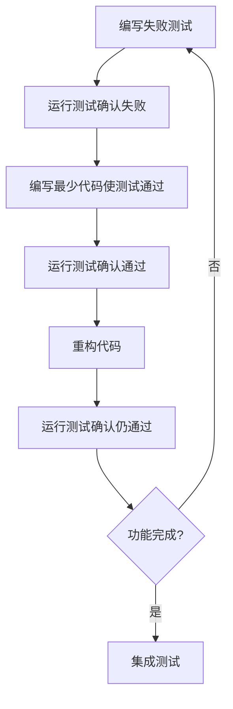
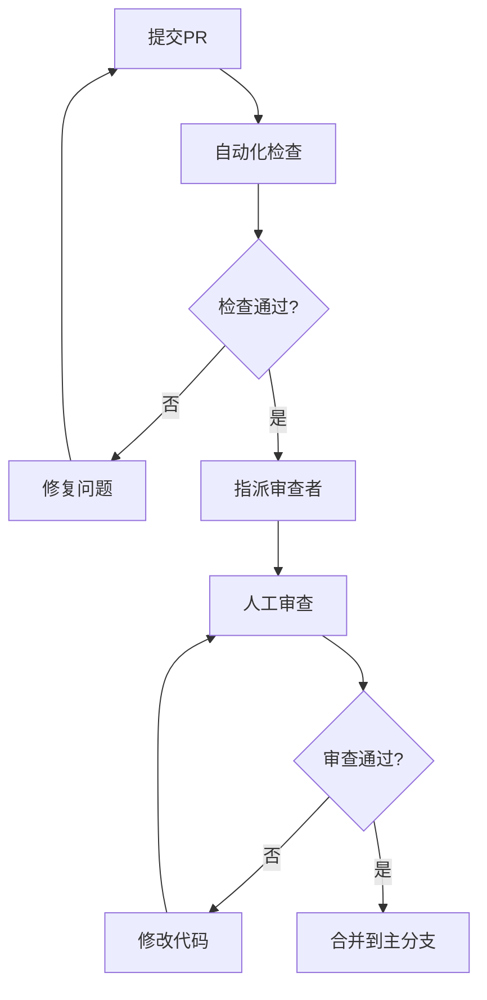

# 开发流程与工作规范

## 📖 概述

本文档定义了PoE2智能构筑生成器的标准开发流程，确保代码质量、团队协作效率和项目长期可维护性。

## 🚀 完整开发流程

### Phase 1: 需求分析与设计 (Design Phase)

#### 1.1 需求收集


**具体步骤:**
1. **需求文档化**
   - 在 `docs/requirements/` 创建需求文档
   - 使用用户故事格式: "作为[角色]，我希望[功能]，以便[目标]"
   - 定义验收标准

2. **技术可行性分析**
   - 评估现有架构是否支持
   - 识别需要新增的组件
   - 确定数据源需求

3. **接口设计**
   - 定义新的接口或扩展现有接口
   - 更新 `src/poe2build/data_sources/interfaces.py`
   - 创建接口设计文档

#### 1.2 架构设计
```python
# 例如：添加新数据源的设计
class IPoE2DataSource(Protocol):
    """PoE2数据源接口"""
    def get_data(self, query: Dict[str, Any]) -> Dict[str, Any]: ...
    def health_check(self) -> bool: ...
    def get_cache_key(self, query: Dict[str, Any]) -> str: ...

class NewDataSourceProvider(PoE2RealDataProvider):
    """新数据源实现设计"""
    def __init__(self, config: DataSourceConfig):
        super().__init__()
        self.config = config
        self.circuit_breaker = CircuitBreaker(
            failure_threshold=config.failure_threshold,
            recovery_timeout=config.recovery_timeout
        )
```

#### 1.3 数据模型设计
```python
# 例如：新的数据模型设计
@dataclass
class PoE2PassiveTree:
    """天赋树数据模型"""
    nodes: Dict[int, PoE2PassiveNode]
    allocated_nodes: Set[int]
    character_class: PoE2CharacterClass
    ascendancy_points: int
    
    def calculate_total_stats(self) -> Dict[str, float]:
        """计算总属性加成"""
        pass
    
    def validate_allocation(self) -> bool:
        """验证天赋点分配合法性"""
        pass
```

### Phase 2: 开发准备 (Setup Phase)

#### 2.1 分支创建策略
```bash
# 功能开发分支命名规范
feature/interface-based-architecture    # 大型架构改进
feature/add-passive-tree-support      # 新功能
feature/enhance-circuit-breaker        # 功能增强

# Bug修复分支
fix/scout-api-timeout-issue           # Bug修复
hotfix/critical-calculation-error     # 紧急修复

# 重构分支  
refactor/data-source-abstraction      # 代码重构
refactor/extract-cache-layer          # 提取抽象层
```

#### 2.2 开发环境检查清单
```bash
# 自动化检查脚本
#!/bin/bash
echo "🔍 开发环境检查..."

# 1. Python版本检查
python_version=$(python --version 2>&1 | awk '{print $2}')
echo "Python版本: $python_version"

# 2. 依赖检查
pip check
echo "✅ 依赖检查完成"

# 3. 代码质量工具检查
black --version
flake8 --version  
mypy --version
echo "✅ 代码质量工具就绪"

# 4. 测试环境检查
pytest --version
echo "✅ 测试环境就绪"

# 5. Git钩子检查
if [ -f .git/hooks/pre-commit ]; then
    echo "✅ Git预提交钩子已安装"
else
    echo "⚠️  请运行: pre-commit install"
fi

echo "🎉 开发环境检查完成"
```

### Phase 3: 测试驱动开发 (TDD Phase)

#### 3.1 测试优先开发流程


#### 3.2 测试编写规范

**单元测试示例:**
```python
# tests/unit/test_new_feature.py
import pytest
from unittest.mock import Mock, patch
from src.poe2build.core.new_feature import NewFeatureClass

class TestNewFeatureClass:
    """新功能类的单元测试"""
    
    def setup_method(self):
        """每个测试方法前的设置"""
        self.feature = NewFeatureClass()
    
    def test_initialization(self):
        """测试初始化"""
        assert self.feature is not None
        assert hasattr(self.feature, 'required_attribute')
    
    @pytest.mark.parametrize("input_data,expected_output", [
        ({'level': 85}, {'processed': True}),
        ({'level': 1}, {'processed': True}),
        ({}, {'error': 'missing_level'}),
    ])
    def test_data_processing(self, input_data, expected_output):
        """参数化测试数据处理"""
        result = self.feature.process_data(input_data)
        assert result == expected_output
    
    @patch('src.poe2build.core.new_feature.external_api_call')
    def test_external_api_integration(self, mock_api):
        """测试外部API集成"""
        # 配置模拟响应
        mock_api.return_value = {'status': 'success', 'data': {}}
        
        result = self.feature.fetch_external_data()
        
        # 验证调用
        mock_api.assert_called_once()
        assert result['status'] == 'success'
    
    def test_error_handling(self):
        """测试错误处理"""
        with pytest.raises(ValueError, match="Invalid input"):
            self.feature.process_data({'invalid': 'data'})
```

**集成测试示例:**
```python
# tests/integration/test_new_workflow.py
import pytest
from src.poe2build.core.orchestrator import PoE2RealDataOrchestrator

@pytest.mark.integration
class TestNewWorkflowIntegration:
    """新工作流的集成测试"""
    
    def setup_method(self):
        self.orchestrator = PoE2RealDataOrchestrator()
    
    def test_end_to_end_workflow(self):
        """端到端工作流测试"""
        # 准备测试数据
        user_request = {
            'preferences': {
                'class': 'Ranger',
                'new_feature': 'enabled'  # 新功能开关
            }
        }
        
        # 执行完整流程
        result = self.orchestrator.create_poe2_build_recommendation(user_request)
        
        # 验证新功能集成
        assert 'new_feature_data' in result
        assert result['status'] == 'success'
    
    @pytest.mark.slow
    def test_performance_with_new_feature(self):
        """性能测试"""
        import time
        
        start_time = time.time()
        # 执行操作
        result = self.orchestrator.process_with_new_feature()
        end_time = time.time()
        
        # 性能断言
        execution_time = end_time - start_time
        assert execution_time < 5.0  # 5秒内完成
        assert result is not None
```

### Phase 4: 实现开发 (Implementation Phase)

#### 4.1 编码标准

**代码组织原则:**
```python
# 好的代码示例 - 遵循单一职责原则
class PoE2PassiveTreeCalculator:
    """专门负责天赋树计算的类"""
    
    def __init__(self, passive_data: Dict[str, Any]):
        self._passive_data = passive_data
        self._cache = {}
        self._logger = self._setup_logger()
    
    def calculate_node_stats(self, node_id: int) -> Dict[str, float]:
        """计算单个节点的属性加成
        
        Args:
            node_id: 天赋节点ID
            
        Returns:
            属性加成字典
            
        Raises:
            ValueError: 当节点ID无效时
        """
        if node_id not in self._passive_data['nodes']:
            raise ValueError(f"Invalid node ID: {node_id}")
        
        # 检查缓存
        cache_key = f"node_stats_{node_id}"
        if cache_key in self._cache:
            return self._cache[cache_key]
        
        # 计算逻辑
        node_data = self._passive_data['nodes'][node_id]
        stats = self._process_node_modifiers(node_data['modifiers'])
        
        # 缓存结果
        self._cache[cache_key] = stats
        return stats
    
    def _process_node_modifiers(self, modifiers: List[str]) -> Dict[str, float]:
        """处理节点修饰符 - 私有方法，专注单一任务"""
        stats = {}
        for modifier in modifiers:
            stat_name, value = self._parse_modifier(modifier)
            stats[stat_name] = stats.get(stat_name, 0) + value
        return stats
    
    def _parse_modifier(self, modifier: str) -> Tuple[str, float]:
        """解析修饰符字符串 - 纯函数，易于测试"""
        # 实现修饰符解析逻辑
        pass
    
    def _setup_logger(self):
        """设置日志器"""
        import logging
        logger = logging.getLogger(f"{__name__}.{self.__class__.__name__}")
        return logger
```

**错误处理标准:**
```python
# 自定义异常层次
class PoE2Error(Exception):
    """基础异常类"""
    pass

class PoE2DataError(PoE2Error):
    """数据相关错误"""
    def __init__(self, message: str, data_source: str = None):
        super().__init__(message)
        self.data_source = data_source

class PoE2CalculationError(PoE2Error):
    """计算相关错误"""
    def __init__(self, message: str, build_config: Dict = None):
        super().__init__(message)
        self.build_config = build_config

# 错误处理模式
def safe_calculation(func):
    """安全计算装饰器"""
    def wrapper(*args, **kwargs):
        try:
            return func(*args, **kwargs)
        except PoE2CalculationError:
            # 重新抛出已知错误
            raise
        except Exception as e:
            # 包装未知错误
            raise PoE2CalculationError(f"Calculation failed: {str(e)}") from e
    return wrapper
```

#### 4.2 接口实现规范

```python
# 接口实现必须遵循规范
class NewPoE2DataSource(PoE2RealDataProvider):
    """新数据源实现"""
    
    def __init__(self, config: NewDataSourceConfig):
        super().__init__()
        self.config = config
        self.base_url = config.base_url
        
        # 弹性组件初始化
        self.circuit_breaker = CircuitBreaker(
            failure_threshold=config.failure_threshold,
            recovery_timeout=config.recovery_timeout
        )
        self.rate_limiter = RateLimiter(
            requests_per_minute=config.rate_limit
        )
    
    def get_data(self, query: Dict[str, Any]) -> Dict[str, Any]:
        """实现接口方法 - 必须包含所有弹性机制"""
        # 1. 断路器检查
        if self.circuit_breaker.is_open():
            raise PoE2DataError("Circuit breaker is open", self.get_source_name())
        
        # 2. 缓存检查
        cache_key = self.get_cache_key(query)
        cached_data = self._get_from_cache(cache_key, self.config.cache_ttl)
        if cached_data:
            return cached_data
        
        # 3. 限流处理
        try:
            with self.rate_limiter:
                # 4. 实际API调用
                response = self._make_api_request(query)
                
                # 5. 数据处理
                processed_data = self._process_response(response)
                
                # 6. 缓存结果
                self._set_cache(cache_key, processed_data)
                
                # 7. 重置断路器
                self.circuit_breaker.record_success()
                
                return processed_data
                
        except Exception as e:
            # 8. 错误处理
            self.circuit_breaker.record_failure()
            
            # 9. 降级处理
            fallback_data = self._get_fallback_data(query)
            if fallback_data:
                return fallback_data
                
            raise PoE2DataError(f"Failed to fetch data: {str(e)}", self.get_source_name())
    
    def health_check(self) -> bool:
        """健康检查实现"""
        try:
            response = self.session.get(
                f"{self.base_url}/health", 
                timeout=5
            )
            return response.status_code == 200
        except:
            return False
    
    def get_source_name(self) -> str:
        """返回数据源名称"""
        return "new_poe2_data_source"
    
    def get_cache_key(self, query: Dict[str, Any]) -> str:
        """生成缓存键"""
        import hashlib
        query_str = json.dumps(query, sort_keys=True)
        return f"{self.get_source_name()}_{hashlib.md5(query_str.encode()).hexdigest()}"
```

### Phase 5: 质量保证 (Quality Assurance Phase)

#### 5.1 代码审查流程


**审查清单:**
```markdown
## 代码审查清单

### 功能性 ✅
- [ ] 功能按预期工作
- [ ] 处理所有边界情况
- [ ] 包含适当的错误处理
- [ ] 有充足的测试覆盖率 (>85%)

### 代码质量 ✅  
- [ ] 遵循项目编码规范
- [ ] 函数和类有清晰的文档字符串
- [ ] 变量和函数命名有意义
- [ ] 避免代码重复
- [ ] 适当的类型注解

### 架构一致性 ✅
- [ ] 遵循现有架构模式
- [ ] 正确使用依赖注入
- [ ] 实现所需的接口
- [ ] 包含弹性机制(断路器、限流等)

### 性能和安全 ✅
- [ ] 没有明显的性能问题
- [ ] 正确处理敏感数据
- [ ] 适当的资源管理
- [ ] 没有引入安全漏洞

### 测试质量 ✅
- [ ] 单元测试覆盖核心逻辑
- [ ] 集成测试覆盖关键流程
- [ ] 测试用例有意义且全面
- [ ] 模拟和存根使用合理

### 文档更新 ✅
- [ ] 更新相关API文档
- [ ] 更新用户文档
- [ ] 添加代码注释说明复杂逻辑
- [ ] 更新CHANGELOG
```

#### 5.2 自动化测试流程
```yaml
# .github/workflows/ci.yml
name: CI Pipeline

on:
  pull_request:
    branches: [main, develop]
  push:
    branches: [main, develop]

jobs:
  quality-checks:
    runs-on: ubuntu-latest
    steps:
      - uses: actions/checkout@v3
      
      - name: Set up Python
        uses: actions/setup-python@v4
        with:
          python-version: '3.8'
      
      - name: Install dependencies
        run: |
          python -m pip install --upgrade pip
          pip install -r requirements-dev.txt
      
      - name: Code formatting check
        run: black --check src/ tests/
      
      - name: Linting
        run: flake8 src/ tests/
      
      - name: Type checking
        run: mypy src/poe2build/
      
      - name: Security scanning
        run: bandit -r src/
  
  unit-tests:
    runs-on: ubuntu-latest
    strategy:
      matrix:
        python-version: [3.8, 3.9, 3.10, 3.11]
    
    steps:
      - uses: actions/checkout@v3
      
      - name: Set up Python ${{ matrix.python-version }}
        uses: actions/setup-python@v4
        with:
          python-version: ${{ matrix.python-version }}
      
      - name: Install dependencies
        run: |
          pip install -r requirements-dev.txt
      
      - name: Run unit tests
        run: |
          pytest tests/unit/ -v --cov=src/poe2build --cov-report=xml
      
      - name: Upload coverage
        uses: codecov/codecov-action@v3
        with:
          file: ./coverage.xml
  
  integration-tests:
    runs-on: ubuntu-latest
    needs: unit-tests
    
    steps:
      - uses: actions/checkout@v3
      
      - name: Set up Python
        uses: actions/setup-python@v4
        with:
          python-version: '3.9'
      
      - name: Install dependencies
        run: pip install -r requirements-dev.txt
      
      - name: Run integration tests
        run: pytest tests/integration/ -v -m integration
```

### Phase 6: 部署准备 (Deployment Preparation)

#### 6.1 版本管理
```python
# version.py
"""版本管理模块"""

import re
from typing import Tuple

__version__ = "2.1.0"

def parse_version(version_str: str) -> Tuple[int, int, int]:
    """解析版本字符串"""
    match = re.match(r'^(\d+)\.(\d+)\.(\d+)(?:-.*)?$', version_str)
    if not match:
        raise ValueError(f"Invalid version format: {version_str}")
    
    return tuple(int(x) for x in match.groups())

def is_compatible_version(required: str, actual: str) -> bool:
    """检查版本兼容性"""
    req_major, req_minor, req_patch = parse_version(required)
    act_major, act_minor, act_patch = parse_version(actual)
    
    # 主版本必须相同
    if req_major != act_major:
        return False
    
    # 次版本向后兼容
    if act_minor < req_minor:
        return False
    
    # 修订版本向后兼容
    if act_minor == req_minor and act_patch < req_patch:
        return False
    
    return True

# 版本信息字典
VERSION_INFO = {
    'major': 2,
    'minor': 1, 
    'patch': 0,
    'release': 'stable',
    'build_number': None
}
```

#### 6.2 发布检查清单
```bash
#!/bin/bash
# scripts/release_checklist.sh

echo "🚀 发布前检查清单"

# 1. 代码质量检查
echo "1. 运行代码质量检查..."
python -m black src/ tests/ --check
python -m flake8 src/ tests/
python -m mypy src/poe2build/

# 2. 完整测试套件
echo "2. 运行完整测试套件..."
python -m pytest tests/ -v --cov=src/poe2build --cov-report=term-missing

# 3. 文档检查
echo "3. 检查文档完整性..."
# 检查README
if [ ! -f README.md ]; then
    echo "❌ 缺少README.md"
    exit 1
fi

# 检查CHANGELOG
if [ ! -f CHANGELOG.md ]; then
    echo "❌ 缺少CHANGELOG.md"
    exit 1
fi

# 4. 依赖检查
echo "4. 检查依赖安全性..."
python -m pip check
python -m safety check

# 5. 版本一致性检查
echo "5. 检查版本一致性..."
version_py=$(python -c "from version import __version__; print(__version__)")
setup_version=$(python setup.py --version)

if [ "$version_py" != "$setup_version" ]; then
    echo "❌ 版本不一致: version.py($version_py) vs setup.py($setup_version)"
    exit 1
fi

# 6. 构建检查
echo "6. 检查包构建..."
python setup.py sdist bdist_wheel
twine check dist/*

echo "✅ 发布前检查完成"
```

### Phase 7: 部署与监控 (Deployment & Monitoring)

#### 7.1 部署脚本
```python
# scripts/deploy.py
"""部署自动化脚本"""
import subprocess
import sys
import os
from pathlib import Path

def run_command(cmd: str, description: str) -> bool:
    """执行命令并处理结果"""
    print(f"📦 {description}...")
    try:
        result = subprocess.run(cmd, shell=True, check=True, capture_output=True, text=True)
        print(f"✅ {description} 完成")
        return True
    except subprocess.CalledProcessError as e:
        print(f"❌ {description} 失败: {e.stderr}")
        return False

def deploy_to_pypi():
    """部署到PyPI"""
    steps = [
        ("python setup.py sdist bdist_wheel", "构建分发包"),
        ("twine check dist/*", "检查分发包"),
        ("twine upload dist/*", "上传到PyPI"),
    ]
    
    for cmd, desc in steps:
        if not run_command(cmd, desc):
            return False
    
    print("🎉 PyPI部署完成")
    return True

def deploy_to_docker():
    """构建并部署Docker镜像"""
    steps = [
        ("docker build -t poe2build:latest .", "构建Docker镜像"),
        ("docker tag poe2build:latest your-registry/poe2build:latest", "标记镜像"),
        ("docker push your-registry/poe2build:latest", "推送镜像"),
    ]
    
    for cmd, desc in steps:
        if not run_command(cmd, desc):
            return False
    
    print("🐳 Docker部署完成")
    return True

if __name__ == "__main__":
    deployment_type = sys.argv[1] if len(sys.argv) > 1 else "pypi"
    
    if deployment_type == "pypi":
        deploy_to_pypi()
    elif deployment_type == "docker":
        deploy_to_docker()
    else:
        print("未知的部署类型。支持: pypi, docker")
        sys.exit(1)
```

## 📊 开发度量与监控

### 关键指标追踪
```python
# tools/metrics_collector.py
"""开发度量收集器"""
import json
import subprocess
from datetime import datetime
from pathlib import Path

class DevelopmentMetrics:
    """开发度量收集"""
    
    def collect_code_metrics(self) -> dict:
        """收集代码质量度量"""
        # 代码行数统计
        loc_result = subprocess.run(['cloc', 'src/'], capture_output=True, text=True)
        
        # 测试覆盖率
        coverage_result = subprocess.run(['coverage', 'report', '--format=json'], capture_output=True, text=True)
        coverage_data = json.loads(coverage_result.stdout) if coverage_result.returncode == 0 else {}
        
        # 复杂度分析
        complexity_result = subprocess.run(['radon', 'cc', 'src/', '-j'], capture_output=True, text=True)
        complexity_data = json.loads(complexity_result.stdout) if complexity_result.returncode == 0 else {}
        
        return {
            'timestamp': datetime.now().isoformat(),
            'lines_of_code': self._parse_cloc_output(loc_result.stdout),
            'test_coverage': coverage_data.get('totals', {}).get('percent_covered', 0),
            'complexity': self._calculate_avg_complexity(complexity_data),
        }
    
    def collect_performance_metrics(self) -> dict:
        """收集性能度量"""
        # 运行性能测试
        perf_result = subprocess.run(['pytest', 'tests/performance/', '--benchmark-json=benchmark.json'], 
                                   capture_output=True, text=True)
        
        benchmark_data = {}
        benchmark_file = Path('benchmark.json')
        if benchmark_file.exists():
            with open(benchmark_file) as f:
                benchmark_data = json.load(f)
        
        return {
            'timestamp': datetime.now().isoformat(),
            'benchmark_results': benchmark_data.get('benchmarks', []),
            'performance_regression': self._detect_performance_regression(benchmark_data)
        }
    
    def generate_report(self):
        """生成开发报告"""
        code_metrics = self.collect_code_metrics()
        performance_metrics = self.collect_performance_metrics()
        
        report = {
            'report_date': datetime.now().isoformat(),
            'code_quality': code_metrics,
            'performance': performance_metrics,
            'recommendations': self._generate_recommendations(code_metrics, performance_metrics)
        }
        
        # 保存报告
        report_file = Path(f"reports/dev_report_{datetime.now().strftime('%Y%m%d')}.json")
        report_file.parent.mkdir(exist_ok=True)
        
        with open(report_file, 'w') as f:
            json.dump(report, f, indent=2)
        
        print(f"📊 开发报告已生成: {report_file}")
        return report
```

## 📋 工作流程总结

### 日常开发流程
```bash
# 1. 更新本地代码
git checkout develop
git pull origin develop

# 2. 创建功能分支
git checkout -b feature/new-amazing-feature

# 3. 设置开发环境
python scripts/setup_dev.py

# 4. 编写测试 (TDD)
# 创建 tests/unit/test_new_feature.py
# 运行测试确认失败: pytest tests/unit/test_new_feature.py

# 5. 实现功能
# 编辑 src/poe2build/core/new_feature.py
# 运行测试确认通过: pytest tests/unit/test_new_feature.py

# 6. 代码质量检查
python scripts/run_tests.py --quality

# 7. 运行完整测试套件
python scripts/run_tests.py --all

# 8. 提交代码
git add .
git commit -m "feat: add amazing new feature

- Implement new feature with TDD approach
- Add comprehensive unit tests
- Update documentation
- Ensure backward compatibility

Closes #123"

# 9. 推送分支
git push origin feature/new-amazing-feature

# 10. 创建Pull Request
# 在GitHub上创建PR，等待审查
```

### 发布流程
```bash
# 1. 准备发布分支
git checkout -b release/v2.1.0

# 2. 更新版本信息
# 编辑 version.py
# 编辑 CHANGELOG.md

# 3. 发布前检查
bash scripts/release_checklist.sh

# 4. 合并到主分支
git checkout main
git merge release/v2.1.0

# 5. 创建发布标签
git tag -a v2.1.0 -m "Release version 2.1.0"

# 6. 执行部署
python scripts/deploy.py pypi

# 7. 推送更新
git push origin main --tags
```

---

**总结**: 这个开发流程确保了代码质量、团队协作效率和项目的长期可维护性。通过严格的测试驱动开发、代码审查和自动化部署，项目能够持续稳定地演进。