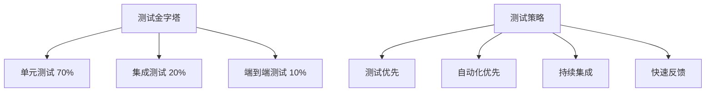

# 测试策略与质量保证

## 📖 概述

本文档定义了PoE2智能构筑生成器的全面测试策略，涵盖单元测试、集成测试、性能测试和端到端测试。确保系统的可靠性、性能和用户体验。

## 🎯 测试目标与原则

### 核心目标
- **功能正确性**: 确保所有功能按预期工作
- **数据准确性**: 确保PoE2计算结果的准确性
- **系统稳定性**: 确保系统在各种条件下稳定运行
- **性能保证**: 确保响应时间在可接受范围内
- **用户体验**: 确保最终用户获得良好体验

### 测试原则


## 🔬 测试分层架构

### Level 1: 单元测试 (Unit Tests)

#### 1.1 测试范围
```python
# 单元测试覆盖的组件
UNIT_TEST_COMPONENTS = [
    'data_sources.interfaces',        # 数据源接口
    'data_sources.base_provider',     # 基础数据提供者
    'data_sources.poe2_scout',        # PoE2Scout API
    'data_sources.poe2db_scraper',    # PoE2DB爬虫
    'data_sources.ninja_scraper',     # poe.ninja爬虫
    'core.calculator',                # 计算引擎
    'core.recommender',               # 推荐引擎
    'models.*',                       # 所有数据模型
    'utils.*',                        # 工具函数
    'resilience.*',                   # 弹性组件
]
```

#### 1.2 单元测试示例

**数据源测试:**
```python
# tests/unit/data_sources/test_poe2_scout.py
import pytest
import requests
from unittest.mock import Mock, patch, MagicMock
from src.poe2build.data_sources.poe2_scout import PoE2ScoutAPI

class TestPoE2ScoutAPI:
    """PoE2Scout API单元测试"""
    
    def setup_method(self):
        """每个测试方法的设置"""
        self.scout_api = PoE2ScoutAPI()
        self.scout_api.session = MagicMock()
    
    def test_initialization(self):
        """测试初始化"""
        api = PoE2ScoutAPI()
        assert api.base_url == "https://poe2scout.com"
        assert hasattr(api, 'session')
        assert hasattr(api, 'cache')
        assert hasattr(api, 'circuit_breaker')
    
    @patch('time.time', return_value=1000000)
    def test_cache_functionality(self, mock_time):
        """测试缓存功能"""
        # 设置缓存
        test_data = {'test': 'data', 'timestamp': 1000000}
        self.scout_api._set_cache('test_key', test_data)
        
        # 立即获取 - 应该命中缓存
        cached = self.scout_api._get_from_cache('test_key', 3600)
        assert cached == test_data
        
        # 过期后获取 - 应该返回None
        mock_time.return_value = 1004000  # 1小时后
        expired = self.scout_api._get_from_cache('test_key', 3600)
        assert expired is None
    
    def test_get_market_data_success(self):
        """测试市场数据获取成功"""
        # 模拟成功响应
        mock_response = Mock()
        mock_response.status_code = 200
        mock_response.json.return_value = {
            'status': 'success',
            'data': {
                'items': [
                    {'name': 'Divine Orb', 'price': 1.0},
                    {'name': 'Exalted Orb', 'price': 0.1}
                ]
            }
        }
        self.scout_api.session.get.return_value = mock_response
        
        result = self.scout_api.get_market_data()
        
        # 验证结果
        assert result['status'] == 'success'
        assert 'data' in result
        assert len(result['data']['items']) == 2
        assert result['data']['items'][0]['name'] == 'Divine Orb'
    
    def test_get_market_data_network_error(self):
        """测试网络错误处理"""
        # 模拟网络异常
        self.scout_api.session.get.side_effect = requests.RequestException("Network error")
        
        result = self.scout_api.get_market_data()
        
        # 验证降级响应
        assert result['status'] == 'mock'
        assert 'error' in result
        assert 'fallback' in result
    
    def test_get_market_data_http_error(self):
        """测试HTTP错误处理"""
        # 模拟HTTP错误
        mock_response = Mock()
        mock_response.status_code = 500
        mock_response.raise_for_status.side_effect = requests.HTTPError("Server error")
        self.scout_api.session.get.return_value = mock_response
        
        result = self.scout_api.get_market_data()
        
        # 验证错误处理
        assert result['status'] in ['mock', 'error']
    
    def test_circuit_breaker_integration(self):
        """测试断路器集成"""
        # 模拟多次失败触发断路器
        self.scout_api.session.get.side_effect = requests.RequestException("Repeated failure")
        
        # 触发失败次数达到阈值
        for _ in range(6):  # 超过默认的5次失败阈值
            result = self.scout_api.get_market_data()
            assert result['status'] in ['mock', 'error']
        
        # 验证断路器状态
        assert self.scout_api.circuit_breaker.failure_count >= 5
```

**计算引擎测试:**
```python
# tests/unit/core/test_calculator.py
import pytest
from src.poe2build.core.calculator import PoE2RealBuildCalculator
from src.poe2build.models.build import PoE2Build, PoE2BuildStats
from src.poe2build.models.characters import PoE2CharacterClass

class TestPoE2RealBuildCalculator:
    """PoE2计算引擎单元测试"""
    
    def setup_method(self):
        """测试设置"""
        mock_poe2db = Mock()
        mock_poe2db.get_skill_data.return_value = {'skills': self._get_mock_skills()}
        mock_poe2db.get_item_data.return_value = {'items': self._get_mock_items()}
        
        self.calculator = PoE2RealBuildCalculator(mock_poe2db)
    
    def _get_mock_skills(self):
        """获取模拟技能数据"""
        return [
            {
                'name': 'Lightning Arrow',
                'base_damage': 120,
                'damage_effectiveness': 100,
                'damage_types': ['lightning', 'projectile']
            },
            {
                'name': 'Fire Ball',
                'base_damage': 150,
                'damage_effectiveness': 120,
                'damage_types': ['fire', 'spell']
            }
        ]
    
    def _get_mock_items(self):
        """获取模拟物品数据"""
        return [
            {
                'name': 'Lightning Bow',
                'type': 'bow',
                'base_damage': [80, 120],
                'modifiers': ['+50% Lightning Damage']
            }
        ]
    
    @pytest.mark.parametrize("level,expected_base_damage", [
        (1, 120),    # 最低等级
        (50, 180),   # 中等等级
        (85, 220),   # 高等级
        (100, 240),  # 最高等级
    ])
    def test_level_scaling_calculation(self, level, expected_base_damage):
        """测试等级缩放计算"""
        build_config = {
            'main_skill': 'Lightning Arrow',
            'level': level,
            'weapon': {'base_damage': [80, 120]}
        }
        
        result = self.calculator.calculate_poe2_build(build_config)
        
        # 验证等级缩放
        base_damage = result['dps']['base_damage']
        assert abs(base_damage - expected_base_damage) < 10  # 允许小幅误差
    
    def test_poe2_resistance_cap(self):
        """测试PoE2特有的80%抗性上限"""
        build_config = {
            'level': 85,
            'items': {
                'armor': {
                    'modifiers': [
                        '+50% Fire Resistance',
                        '+60% Cold Resistance', 
                        '+90% Lightning Resistance'  # 超过上限
                    ]
                }
            }
        }
        
        result = self.calculator.calculate_poe2_build(build_config)
        defenses = result['defenses']
        
        # 验证PoE2抗性上限
        assert defenses['fire_resistance'] <= 80
        assert defenses['cold_resistance'] <= 80
        assert defenses['lightning_resistance'] == 80  # 被限制在上限
        assert defenses['chaos_resistance'] >= -40   # PoE2混沌抗性惩罚
    
    def test_energy_shield_calculation(self):
        """测试能量护盾计算"""
        build_config = {
            'level': 85,
            'items': {
                'armor': {'energy_shield': 300},
                'helmet': {'energy_shield': 150},
                'shield': {'energy_shield': 200}
            },
            'passive_bonuses': {
                'energy_shield_percentage': 50,  # +50% ES
                'energy_shield_flat': 100       # +100 flat ES
            }
        }
        
        result = self.calculator.calculate_poe2_build(build_config)
        es_data = result['survivability']
        
        # 验证ES计算
        expected_base_es = 300 + 150 + 200  # 650
        expected_with_percentage = expected_base_es * 1.5  # 975
        expected_final = expected_with_percentage + 100    # 1075
        
        assert abs(es_data['total_energy_shield'] - expected_final) < 1
    
    def test_dps_calculation_with_support_gems(self):
        """测试带辅助宝石的DPS计算"""
        build_config = {
            'main_skill': 'Lightning Arrow',
            'level': 85,
            'weapon': {'base_damage': [100, 150]},
            'support_gems': [
                {'name': 'Added Lightning Damage', 'damage_multiplier': 1.3},
                {'name': 'Faster Attacks', 'attack_speed_multiplier': 1.2},
                {'name': 'Lightning Penetration', 'penetration': 35}
            ]
        }
        
        result = self.calculator.calculate_poe2_build(build_config)
        dps_data = result['dps']
        
        # 验证DPS计算包含所有加成
        assert dps_data['total_dps'] > 0
        assert 'damage_breakdown' in dps_data
        assert 'support_gem_multipliers' in dps_data
    
    def test_calculation_error_handling(self):
        """测试计算错误处理"""
        # 无效的构筑配置
        invalid_config = {
            'level': -1,  # 无效等级
            'main_skill': 'NonexistentSkill'
        }
        
        with pytest.raises(ValueError, match="Invalid level"):
            self.calculator.calculate_poe2_build(invalid_config)
    
    def test_performance_calculation_large_build(self):
        """测试大型构筑的计算性能"""
        import time
        
        complex_build = {
            'main_skill': 'Lightning Arrow',
            'level': 100,
            'items': {f'item_{i}': {'damage': i} for i in range(50)},  # 50个物品
            'passive_tree': {f'node_{i}': {'bonus': i} for i in range(200)}  # 200个天赋点
        }
        
        start_time = time.time()
        result = self.calculator.calculate_poe2_build(complex_build)
        end_time = time.time()
        
        # 性能要求：复杂计算应在1秒内完成
        calculation_time = end_time - start_time
        assert calculation_time < 1.0
        assert result is not None
```

### Level 2: 集成测试 (Integration Tests)

#### 2.1 数据源集成测试
```python
# tests/integration/test_data_source_integration.py
import pytest
import time
from src.poe2build.core.orchestrator import PoE2RealDataOrchestrator

@pytest.mark.integration
class TestDataSourceIntegration:
    """数据源集成测试"""
    
    def setup_method(self):
        self.orchestrator = PoE2RealDataOrchestrator()
    
    @pytest.mark.slow
    def test_all_data_sources_connectivity(self):
        """测试所有数据源连通性"""
        # 测试每个数据源
        sources = {
            'poe2_scout': self.orchestrator.poe2_scout,
            'poe2db': self.orchestrator.poe2db,
            'poe2_ninja': self.orchestrator.poe2_ninja
        }
        
        results = {}
        for name, source in sources.items():
            try:
                # 尝试健康检查
                health = source.health_check()
                results[name] = {'healthy': health, 'error': None}
                
                if health:
                    # 尝试获取基本数据
                    if hasattr(source, 'get_market_data'):
                        data = source.get_market_data()
                        results[name]['data_available'] = 'status' in data
            except Exception as e:
                results[name] = {'healthy': False, 'error': str(e)}
        
        # 至少要有一个数据源可用
        healthy_sources = [name for name, result in results.items() if result['healthy']]
        assert len(healthy_sources) > 0, f"No healthy data sources found: {results}"
    
    def test_data_source_fallback_mechanism(self):
        """测试数据源降级机制"""
        # 模拟主要数据源不可用的情况
        original_get_market_data = self.orchestrator.poe2_scout.get_market_data
        
        # 暂时禁用主数据源
        self.orchestrator.poe2_scout.get_market_data = lambda: {'status': 'error', 'error': 'Simulated failure'}
        
        try:
            user_request = {
                'preferences': {'class': 'Ranger', 'style': 'bow'}
            }
            
            # 系统应该仍能工作（使用降级数据）
            result = self.orchestrator.create_poe2_build_recommendation(user_request)
            
            assert 'recommendations' in result
            # 可能使用模拟数据，但不应该完全失败
            assert result.get('status') in ['success', 'partial', 'mock']
        
        finally:
            # 恢复原始方法
            self.orchestrator.poe2_scout.get_market_data = original_get_market_data
    
    def test_concurrent_data_fetching(self):
        """测试并发数据获取"""
        import concurrent.futures
        
        user_requests = [
            {'preferences': {'class': 'Ranger'}},
            {'preferences': {'class': 'Sorceress'}},
            {'preferences': {'class': 'Warrior'}},
        ]
        
        start_time = time.time()
        
        with concurrent.futures.ThreadPoolExecutor(max_workers=3) as executor:
            futures = [
                executor.submit(self.orchestrator.create_poe2_build_recommendation, req)
                for req in user_requests
            ]
            
            results = [future.result() for future in concurrent.futures.as_completed(futures)]
        
        end_time = time.time()
        
        # 并发处理应该比顺序处理快
        total_time = end_time - start_time
        assert total_time < 60  # 所有请求在1分钟内完成
        assert len(results) == 3
        
        # 验证所有结果都有效
        for result in results:
            assert 'recommendations' in result
```

#### 2.2 端到端工作流测试
```python
# tests/integration/test_full_workflow.py
@pytest.mark.integration
class TestFullWorkflow:
    """完整工作流集成测试"""
    
    def test_complete_recommendation_workflow(self):
        """测试完整的推荐工作流"""
        orchestrator = PoE2RealDataOrchestrator()
        
        # 模拟真实用户请求
        user_request = {
            'game': 'poe2',
            'mode': 'standard',
            'preferences': {
                'class': 'Ranger',
                'ascendancy': 'Deadeye',
                'style': 'bow',
                'goal': 'endgame_content',
                'budget': {'amount': 15, 'currency': 'divine'},
                'experience_level': 'intermediate'
            }
        }
        
        # 执行完整流程
        result = orchestrator.create_poe2_build_recommendation(user_request)
        
        # 验证结果结构
        self._validate_recommendation_result(result)
        
        # 验证业务逻辑
        recommendations = result['recommendations']
        assert len(recommendations) > 0
        
        for rec in recommendations:
            # 验证推荐符合用户偏好
            assert rec.get('class') == 'Ranger'
            assert rec.get('style') == 'bow'
            
            # 验证成本估算
            cost = rec.get('estimated_cost', {})
            if cost:
                assert cost.get('amount', 0) <= 20  # 略高于预算是可接受的
            
            # 验证统计数据完整性
            stats = rec.get('stats', {})
            assert 'dps' in stats
            assert 'defenses' in stats
            assert 'survivability' in stats
    
    def _validate_recommendation_result(self, result):
        """验证推荐结果结构"""
        required_keys = ['recommendations', 'metadata', 'timestamp']
        for key in required_keys:
            assert key in result, f"Missing required key: {key}"
        
        assert isinstance(result['recommendations'], list)
        assert isinstance(result['metadata'], dict)
        
        # 验证元数据
        metadata = result['metadata']
        assert 'data_sources_used' in metadata
        assert 'calculation_time' in metadata
        assert 'cache_hits' in metadata
```

### Level 3: 性能测试 (Performance Tests)

#### 3.1 基准测试
```python
# tests/performance/test_benchmarks.py
import pytest
import time
from memory_profiler import profile
from src.poe2build.core.orchestrator import PoE2RealDataOrchestrator

@pytest.mark.performance
class TestPerformanceBenchmarks:
    """性能基准测试"""
    
    def setup_method(self):
        self.orchestrator = PoE2RealDataOrchestrator()
    
    @pytest.mark.benchmark
    def test_single_recommendation_performance(self, benchmark):
        """单次推荐性能测试"""
        user_request = {
            'preferences': {
                'class': 'Ranger',
                'style': 'bow',
                'goal': 'clear_speed'
            }
        }
        
        # 使用pytest-benchmark进行基准测试
        result = benchmark(self.orchestrator.create_poe2_build_recommendation, user_request)
        
        assert result is not None
        assert 'recommendations' in result
    
    def test_concurrent_load_performance(self):
        """并发负载性能测试"""
        import concurrent.futures
        
        num_concurrent_requests = 10
        user_requests = [
            {'preferences': {'class': f'TestClass{i}'}}
            for i in range(num_concurrent_requests)
        ]
        
        start_time = time.time()
        
        with concurrent.futures.ThreadPoolExecutor(max_workers=5) as executor:
            futures = [
                executor.submit(self.orchestrator.create_poe2_build_recommendation, req)
                for req in user_requests
            ]
            
            results = []
            for future in concurrent.futures.as_completed(futures):
                try:
                    result = future.result(timeout=30)  # 30秒超时
                    results.append(result)
                except Exception as e:
                    print(f"Request failed: {e}")
        
        end_time = time.time()
        total_time = end_time - start_time
        
        # 性能断言
        assert len(results) == num_concurrent_requests
        assert total_time < 60  # 所有请求在1分钟内完成
        
        # 计算平均响应时间
        avg_response_time = total_time / num_concurrent_requests
        assert avg_response_time < 6  # 平均响应时间小于6秒
    
    @profile
    def test_memory_usage_profile(self):
        """内存使用分析"""
        large_request = {
            'preferences': {
                'class': 'Ranger',
                'detailed_analysis': True,
                'include_alternatives': True,
                'max_recommendations': 20
            }
        }
        
        # 执行多次请求来观察内存模式
        for i in range(5):
            result = self.orchestrator.create_poe2_build_recommendation(large_request)
            assert result is not None
    
    def test_cache_performance_impact(self):
        """测试缓存对性能的影响"""
        user_request = {'preferences': {'class': 'Ranger'}}
        
        # 第一次请求（冷缓存）
        start_time = time.time()
        first_result = self.orchestrator.create_poe2_build_recommendation(user_request)
        first_time = time.time() - start_time
        
        # 第二次请求（热缓存）
        start_time = time.time()
        second_result = self.orchestrator.create_poe2_build_recommendation(user_request)
        second_time = time.time() - start_time
        
        # 缓存应该显著提高性能
        assert second_time < first_time * 0.5  # 缓存应该至少快50%
        assert first_result == second_result    # 结果应该一致
```

### Level 4: 端到端测试 (End-to-End Tests)

#### 4.1 用户场景测试
```python
# tests/e2e/test_user_scenarios.py
import pytest
from src.poe2build.cli import main as cli_main
from src.poe2build.api import create_app

@pytest.mark.e2e
class TestUserScenarios:
    """端到端用户场景测试"""
    
    def test_new_player_getting_starter_build(self):
        """新手玩家获取入门构筑场景"""
        # 模拟新手用户请求
        user_input = {
            'experience_level': 'beginner',
            'class_preference': 'any',
            'style_preference': 'safe',
            'budget': {'amount': 5, 'currency': 'divine'},
            'goal': 'league_start'
        }
        
        orchestrator = PoE2RealDataOrchestrator()
        result = orchestrator.create_poe2_build_recommendation(user_input)
        
        # 验证新手友好的推荐
        assert len(result['recommendations']) > 0
        
        for rec in result['recommendations']:
            # 新手构筑应该简单易用
            assert rec.get('complexity_rating', 'high') in ['low', 'medium']
            
            # 成本应该在预算内
            cost = rec.get('estimated_cost', {}).get('amount', 0)
            assert cost <= 7  # 略高于预算是可接受的
            
            # 应该有详细的说明
            assert 'description' in rec
            assert 'leveling_guide' in rec
    
    def test_experienced_player_min_maxing_build(self):
        """经验丰富玩家优化构筑场景"""
        user_input = {
            'experience_level': 'expert',
            'class': 'Sorceress',
            'ascendancy': 'Chronomancer', 
            'style': 'spell_caster',
            'goal': 'boss_killing',
            'budget': {'amount': 100, 'currency': 'divine'},
            'optimization_target': 'maximum_dps'
        }
        
        orchestrator = PoE2RealDataOrchestrator()
        result = orchestrator.create_poe2_build_recommendation(user_input)
        
        # 验证高端构筑推荐
        recommendations = result['recommendations']
        assert len(recommendations) > 0
        
        # 高端构筑应该有高DPS
        best_build = max(recommendations, key=lambda x: x.get('stats', {}).get('dps', {}).get('total_dps', 0))
        assert best_build['stats']['dps']['total_dps'] > 1000000  # 100万DPS
        
        # 应该有详细的优化建议
        assert 'optimization_notes' in best_build
        assert 'min_max_options' in best_build
    
    def test_budget_conscious_player_scenario(self):
        """预算有限玩家场景"""
        user_input = {
            'budget': {'amount': 2, 'currency': 'divine'},
            'goal': 'clear_speed',
            'constraints': ['budget_friendly', 'league_start_viable']
        }
        
        orchestrator = PoE2RealDataOrchestrator()
        result = orchestrator.create_poe2_build_recommendation(user_input)
        
        # 所有推荐都应该在预算内
        for rec in result['recommendations']:
            cost = rec.get('estimated_cost', {}).get('amount', float('inf'))
            assert cost <= 3  # 严格预算控制
            
            # 应该标注为预算友好
            assert 'budget_friendly' in rec.get('tags', [])
```

## 📊 测试质量度量

### 测试覆盖率要求
```python
# conftest.py - 测试覆盖率配置
import pytest

# 覆盖率要求
COVERAGE_REQUIREMENTS = {
    'src/poe2build/core/': 95,         # 核心模块要求95%覆盖率
    'src/poe2build/data_sources/': 90, # 数据源模块90%覆盖率  
    'src/poe2build/models/': 85,       # 模型类85%覆盖率
    'src/poe2build/utils/': 80,        # 工具函数80%覆盖率
    'src/poe2build/resilience/': 90,   # 弹性组件90%覆盖率
}

def pytest_collection_modifyitems(config, items):
    """标记慢速测试"""
    for item in items:
        if "integration" in item.keywords:
            item.add_marker(pytest.mark.slow)
        if "e2e" in item.keywords:
            item.add_marker(pytest.mark.slow)
        if "performance" in item.keywords:
            item.add_marker(pytest.mark.slow)

@pytest.fixture(scope="session", autouse=True)
def coverage_check():
    """会话结束后检查覆盖率"""
    yield
    # 这里可以添加覆盖率检查逻辑
```

### 测试数据管理
```python
# tests/fixtures/data_manager.py
"""测试数据管理"""
import json
from pathlib import Path
from typing import Dict, Any

class TestDataManager:
    """测试数据管理器"""
    
    def __init__(self):
        self.fixtures_dir = Path(__file__).parent
        self._cache = {}
    
    def get_sample_builds(self, character_class: str = None) -> list:
        """获取示例构筑数据"""
        builds = self._load_json('sample_builds.json')
        
        if character_class:
            return [b for b in builds if b.get('class') == character_class]
        
        return builds
    
    def get_sample_market_data(self) -> Dict[str, Any]:
        """获取示例市场数据"""
        return self._load_json('sample_market_data.json')
    
    def get_mock_api_response(self, source: str, endpoint: str) -> Dict[str, Any]:
        """获取模拟API响应"""
        filename = f"{source}_{endpoint}_response.json"
        return self._load_json(f"mock_responses/{filename}")
    
    def _load_json(self, filename: str) -> Dict[str, Any]:
        """加载JSON文件"""
        if filename in self._cache:
            return self._cache[filename]
        
        file_path = self.fixtures_dir / filename
        with open(file_path, 'r', encoding='utf-8') as f:
            data = json.load(f)
        
        self._cache[filename] = data
        return data

# 全局实例
test_data_manager = TestDataManager()
```

## 🚀 自动化测试流程

### CI/CD集成
```yaml
# .github/workflows/test.yml
name: Test Suite

on:
  push:
    branches: [main, develop]
  pull_request:
    branches: [main]

jobs:
  unit-tests:
    runs-on: ubuntu-latest
    strategy:
      matrix:
        python-version: [3.8, 3.9, 3.10, 3.11]
    
    steps:
      - uses: actions/checkout@v3
      
      - name: Set up Python ${{ matrix.python-version }}
        uses: actions/setup-python@v4
        with:
          python-version: ${{ matrix.python-version }}
      
      - name: Install dependencies
        run: |
          pip install -r requirements-dev.txt
      
      - name: Run unit tests
        run: |
          pytest tests/unit/ -v --cov=src/poe2build --cov-report=xml --cov-fail-under=85
      
      - name: Upload coverage to Codecov
        uses: codecov/codecov-action@v3
        with:
          file: ./coverage.xml
          flags: unit-tests
  
  integration-tests:
    runs-on: ubuntu-latest
    needs: unit-tests
    
    steps:
      - uses: actions/checkout@v3
      
      - name: Set up Python
        uses: actions/setup-python@v4
        with:
          python-version: '3.9'
      
      - name: Install dependencies
        run: pip install -r requirements-dev.txt
      
      - name: Run integration tests
        run: |
          pytest tests/integration/ -v -m integration --maxfail=3
        timeout-minutes: 15
  
  performance-tests:
    runs-on: ubuntu-latest
    needs: integration-tests
    if: github.event_name == 'push' && github.ref == 'refs/heads/main'
    
    steps:
      - uses: actions/checkout@v3
      
      - name: Set up Python
        uses: actions/setup-python@v4
        with:
          python-version: '3.9'
      
      - name: Install dependencies
        run: |
          pip install -r requirements-dev.txt
          pip install pytest-benchmark
      
      - name: Run performance tests
        run: |
          pytest tests/performance/ -v --benchmark-json=benchmark.json
      
      - name: Store benchmark results
        uses: actions/upload-artifact@v3
        with:
          name: benchmark-results
          path: benchmark.json
```

### 测试报告生成
```python
# tools/test_reporter.py
"""测试报告生成器"""
import json
import subprocess
from datetime import datetime
from pathlib import Path

class TestReporter:
    """测试报告生成器"""
    
    def generate_full_report(self):
        """生成完整的测试报告"""
        report_data = {
            'timestamp': datetime.now().isoformat(),
            'test_results': self._run_all_tests(),
            'coverage_report': self._generate_coverage_report(),
            'performance_metrics': self._collect_performance_metrics(),
            'quality_metrics': self._collect_quality_metrics(),
        }
        
        # 生成HTML报告
        self._generate_html_report(report_data)
        
        return report_data
    
    def _run_all_tests(self):
        """运行所有测试"""
        test_suites = {
            'unit': 'tests/unit/',
            'integration': 'tests/integration/ -m integration',
            'e2e': 'tests/e2e/ -m e2e'
        }
        
        results = {}
        for suite_name, test_path in test_suites.items():
            cmd = f"pytest {test_path} --json-report --json-report-file=results_{suite_name}.json"
            result = subprocess.run(cmd, shell=True, capture_output=True, text=True)
            
            # 解析结果
            try:
                with open(f'results_{suite_name}.json') as f:
                    results[suite_name] = json.load(f)
            except FileNotFoundError:
                results[suite_name] = {'error': 'Report file not found'}
        
        return results
    
    def _generate_coverage_report(self):
        """生成覆盖率报告"""
        cmd = "coverage report --format=json"
        result = subprocess.run(cmd, shell=True, capture_output=True, text=True)
        
        if result.returncode == 0:
            return json.loads(result.stdout)
        else:
            return {'error': 'Coverage report failed'}
    
    def _generate_html_report(self, report_data):
        """生成HTML报告"""
        html_template = '''
        <!DOCTYPE html>
        <html>
        <head>
            <title>PoE2 Build Generator - Test Report</title>
            <style>
                body { font-family: Arial, sans-serif; margin: 20px; }
                .metric { margin: 10px 0; padding: 10px; border: 1px solid #ddd; }
                .success { background-color: #d4edda; }
                .warning { background-color: #fff3cd; }
                .error { background-color: #f8d7da; }
            </style>
        </head>
        <body>
            <h1>PoE2 Build Generator - Test Report</h1>
            <p>Generated: {timestamp}</p>
            
            <h2>Test Results Summary</h2>
            {test_summary}
            
            <h2>Coverage Report</h2>
            {coverage_summary}
            
            <h2>Performance Metrics</h2>
            {performance_summary}
        </body>
        </html>
        '''
        
        # 填充模板数据
        html_content = html_template.format(
            timestamp=report_data['timestamp'],
            test_summary=self._format_test_summary(report_data['test_results']),
            coverage_summary=self._format_coverage_summary(report_data['coverage_report']),
            performance_summary=self._format_performance_summary(report_data.get('performance_metrics', {}))
        )
        
        # 保存HTML文件
        report_path = Path('reports') / f"test_report_{datetime.now().strftime('%Y%m%d_%H%M%S')}.html"
        report_path.parent.mkdir(exist_ok=True)
        
        with open(report_path, 'w', encoding='utf-8') as f:
            f.write(html_content)
        
        print(f"HTML报告已生成: {report_path}")
```

---

**总结**: 这个全面的测试策略确保了PoE2智能构筑生成器的质量、性能和可靠性。通过分层测试架构、自动化流程和持续监控，项目能够在快速迭代的同时保持高质量标准。