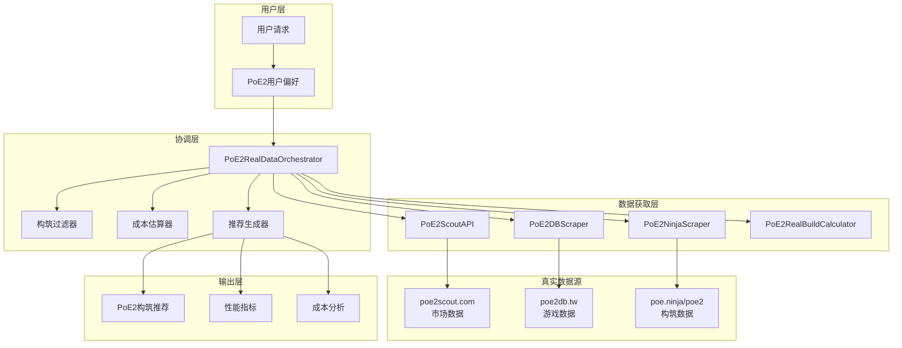
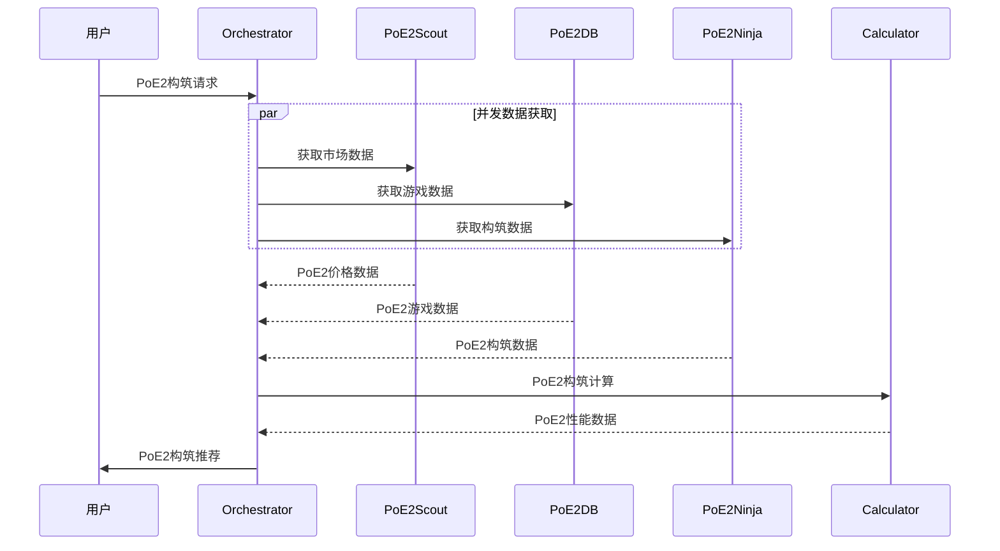

# 真实架构设计

## 📖 概述

本文档详细介绍基于**真实PoE2数据源**的智能构筑生成器系统架构。与之前基于假设API的设计不同，本架构完全基于实际存在且可访问的PoE2服务。

## 🎯 设计原则

### 核心原则
- **真实可用**: 只使用实际存在的PoE2数据源
- **PoE2专用**: 专门针对Path of Exile 2的游戏机制
- **容错优先**: 多层容错机制确保系统稳定性
- **性能优化**: 智能缓存和并发处理

### 架构特点
- **分层设计**: 清晰的职责分离
- **接口驱动**: Interface-based design支持未来官方API迁移
- **插件式**: 易于扩展新的PoE2数据源
- **异步处理**: 支持并发数据获取
- **断路器模式**: Circuit Breaker防止级联故障
- **智能降级**: 数据源失败时自动降级

## 🏗️ 系统架构

### 整体架构图



### 分层详解

#### 1. 用户层
- **功能**: 接收用户的PoE2构筑需求
- **输入**: 职业偏好、构筑风格、预算限制
- **输出**: 结构化的PoE2构筑请求

#### 2. 协调层 (Orchestrator)
- **核心组件**: `PoE2RealDataOrchestrator`
- **职责**: 
  - 协调多个数据源
  - 管理数据获取流程
  - 处理构筑逻辑

#### 3. 数据获取层
- **PoE2ScoutAPI**: 市场和价格数据
- **PoE2DBScraper**: 游戏内容数据  
- **PoE2NinjaScraper**: 构筑分析数据
- **PoE2RealBuildCalculator**: PoE2计算引擎

#### 4. 真实数据源
- **poe2scout.com**: PoE2专用市场数据
- **poe2db.tw**: PoE2游戏数据库
- **poe.ninja/poe2**: PoE2构筑分析

## 🔧 核心组件设计

### 1. PoE2RealDataOrchestrator

```python
class PoE2RealDataOrchestrator:
    """PoE2数据协调器 - 系统核心"""
    
    def __init__(self):
        # 初始化所有PoE2数据源
        self.poe2_scout = PoE2ScoutAPI()
        self.poe2db = PoE2DBScraper()
        self.poe2_ninja = PoE2NinjaScraper()
        self.calculator = PoE2RealBuildCalculator(self.poe2db)
    
    def create_poe2_build_recommendation(self, request: Dict) -> Dict:
        """核心业务逻辑 - 生成PoE2构筑推荐"""
        # 1. 并发获取数据
        market_data = self.poe2_scout.get_market_data()
        builds_data = self.poe2_ninja.get_popular_builds()
        game_data = self.poe2db.get_skill_data()
        
        # 2. 过滤和排序
        filtered_builds = self._filter_builds(builds_data, request)
        
        # 3. 计算详细数据
        recommendations = []
        for build in filtered_builds:
            stats = self.calculator.calculate_poe2_build(build)
            cost = self._estimate_cost(build, market_data)
            recommendations.append({
                'build_name': build['name'],
                'stats': stats,
                'cost': cost
            })
        
        return {'recommendations': recommendations}
```

### 2. 数据源抽象基类

```python
class PoE2RealDataProvider:
    """PoE2数据源基类"""
    
    def __init__(self):
        self.session = requests.Session()
        self.cache = {}
        
    def _get_from_cache(self, key: str, max_age: int) -> Optional[Dict]:
        """缓存管理"""
        if key in self.cache:
            data, timestamp = self.cache[key]
            if time.time() - timestamp < max_age:
                return data
        return None
    
    def _handle_request_failure(self, error: Exception) -> Dict:
        """统一错误处理和降级策略"""
        print(f"数据源请求失败: {error}")
        return self._get_fallback_data()
```

### 3. PoE2专用计算引擎

```python
class PoE2RealBuildCalculator:
    """基于真实PoE2数据的计算引擎"""
    
    def calculate_poe2_build(self, build_config: Dict) -> Dict:
        """PoE2特有机制计算"""
        
        # PoE2特有的DPS计算
        dps = self._calculate_poe2_dps(build_config)
        
        # PoE2特有的防御计算 (80%抗性上限)
        defenses = self._calculate_poe2_defenses(build_config)
        
        # PoE2特有的能量护盾计算
        energy_shield = self._calculate_energy_shield(build_config)
        
        return {
            'dps': dps,
            'defenses': defenses,
            'energy_shield': energy_shield
        }
    
    def _calculate_poe2_defenses(self, config: Dict) -> Dict:
        """PoE2防御计算 - 80%抗性上限"""
        base_res = 70  # PoE2基础抗性
        max_res = 80   # PoE2最大抗性上限
        
        return {
            'fire_resistance': min(base_res + bonuses, max_res),
            'cold_resistance': min(base_res + bonuses, max_res),
            'lightning_resistance': min(base_res + bonuses, max_res),
            'chaos_resistance': max(-30 + bonuses, max_res)
        }
```

## 📊 数据流设计

### 数据流程图



### 缓存策略

| 数据类型 | 缓存时长 | 原因 |
|---------|---------|------|
| PoE2市场价格 | 10分钟 | 价格变化较快 |
| PoE2流行构筑 | 30分钟 | Meta变化相对较慢 |
| PoE2游戏数据 | 1小时 | 游戏数据相对稳定 |
| 计算结果 | 不缓存 | 每次计算结果不同 |

## 🔒 容错机制

### 弹性架构设计

#### Circuit Breaker Pattern
```python
class CircuitBreaker:
    """断路器模式实现"""
    def __init__(self, failure_threshold=5, recovery_timeout=60):
        self.failure_threshold = failure_threshold
        self.recovery_timeout = recovery_timeout
        self.failure_count = 0
        self.state = 'CLOSED'  # CLOSED, OPEN, HALF_OPEN
        self.next_attempt = 0
    
    def call(self, func):
        """断路器调用"""
        if self.state == 'OPEN':
            if time.time() < self.next_attempt:
                raise Exception("Circuit breaker is OPEN")
            else:
                self.state = 'HALF_OPEN'
        
        try:
            result = func()
            self.reset()
            return result
        except Exception as e:
            self.record_failure()
            raise e
```

#### Rate Limiting with Exponential Backoff
```python
def robust_data_fetch(self, source_name: str, fetch_func) -> Dict:
    """多层容错数据获取 + 断路器保护"""
    
    try:
        # 1. 断路器检查
        if self.circuit_breakers[source_name].is_open():
            raise Exception(f"Circuit breaker OPEN for {source_name}")
            
        # 2. 尝试从缓存获取
        cached = self._get_from_cache(source_name)
        if cached:
            return cached
            
        # 3. 限流保护 + 指数退避
        with self.rate_limiters[source_name]:
            data = fetch_func()
            self._set_cache(source_name, data)
            return data
        
    except requests.RequestException as e:
        # 4. 网络错误 - 尝试备用数据源
        try:
            return self._fetch_from_backup_source(source_name)
        except:
            # 5. 所有数据源都失败 - 使用Mock数据
            return self._get_mock_data(source_name)
    
    except Exception as e:
        # 6. 其他错误 - 降级处理
        return self._get_fallback_data(source_name)
```

### 降级策略

1. **数据源失败**: 自动切换到Mock数据
2. **部分数据失败**: 使用默认值补全
3. **计算失败**: 返回估算值
4. **全部失败**: 返回基础推荐

## ⚡ 性能优化

### 并发处理

```python
import asyncio
from concurrent.futures import ThreadPoolExecutor

async def fetch_all_poe2_data(self, request: Dict) -> Dict:
    """并发获取所有PoE2数据"""
    
    with ThreadPoolExecutor() as executor:
        # 并发执行所有数据获取
        tasks = [
            executor.submit(self.poe2_scout.get_market_data),
            executor.submit(self.poe2_ninja.get_popular_builds),
            executor.submit(self.poe2db.get_skill_data)
        ]
        
        # 等待所有任务完成
        results = [task.result() for task in tasks]
        
    return {
        'market_data': results[0],
        'builds_data': results[1], 
        'game_data': results[2]
    }
```

### 内存优化

- **数据分页**: 大数据集分批处理
- **缓存限制**: 限制缓存大小防止内存泄露
- **对象复用**: 复用HTTP连接和解析器

### 网络优化

- **连接池**: 复用HTTP连接
- **压缩传输**: 启用gzip压缩
- **超时控制**: 防止长时间阻塞

## 🔧 扩展性设计

### Interface-Based 模块化设计

```python
class ITradeProvider:
    """交易数据提供者接口"""
    def get_market_data(self, item_name: str) -> Dict:
        pass
    
    def get_pricing_info(self, build_items: List) -> Dict:
        pass

class UnofficialTradeProvider(ITradeProvider):
    """当前基于逆向工程的实现"""
    def __init__(self):
        self.poe2_scout = PoE2ScoutAPI()
        self.circuit_breaker = CircuitBreaker()
    
    def get_market_data(self, item_name: str) -> Dict:
        return self.circuit_breaker.call(
            lambda: self.poe2_scout.get_market_data(item_name)
        )

class OfficialTradeProvider(ITradeProvider):
    """未来GGG官方OAuth API实现"""
    def __init__(self, oauth_token: str):
        self.oauth_token = oauth_token
        # 当GGG发布官方API时，无需改动调用方代码
    
    def get_market_data(self, item_name: str) -> Dict:
        # 官方API实现
        pass

# 工厂模式支持平滑迁移
class TradeProviderFactory:
    @staticmethod
    def create(provider_type: str) -> ITradeProvider:
        if provider_type == 'unofficial':
            return UnofficialTradeProvider()
        elif provider_type == 'official':
            return OfficialTradeProvider()
        else:
            return MockTradeProvider()
```

### 配置驱动

```python
# poe2_config.py
POE2_CONFIG = {
    'data_sources': {
        'poe2_scout': {
            'enabled': True,
            'base_url': 'https://poe2scout.com',
            'timeout': 10,
            'cache_ttl': 600
        },
        'poe2db': {
            'enabled': True,
            'base_url': 'https://poe2db.tw',
            'timeout': 15,
            'cache_ttl': 3600
        }
    },
    'calculation': {
        'max_resistance': 80,  # PoE2最大抗性上限
        'energy_shield_multiplier': 0.3  # PoE2能量护盾基础倍率
    }
}
```

## 📈 监控和指标

### 系统指标

```python
class PoE2SystemMetrics:
    """PoE2系统监控指标"""
    
    def __init__(self):
        self.metrics = {
            'total_requests': 0,
            'successful_requests': 0,
            'cache_hits': 0,
            'data_source_failures': {},
            'average_response_time': 0
        }
    
    def record_request(self, success: bool, response_time: float):
        """记录请求指标"""
        self.metrics['total_requests'] += 1
        if success:
            self.metrics['successful_requests'] += 1
        self.metrics['average_response_time'] = (
            self.metrics['average_response_time'] * (self.metrics['total_requests'] - 1) + 
            response_time
        ) / self.metrics['total_requests']
```

### 健康检查

```python
def health_check(self) -> Dict:
    """系统健康检查"""
    health_status = {
        'status': 'healthy',
        'data_sources': {},
        'timestamp': time.time()
    }
    
    # 检查各个PoE2数据源状态
    for name, source in self.data_sources.items():
        try:
            source.health_check()
            health_status['data_sources'][name] = 'healthy'
        except:
            health_status['data_sources'][name] = 'unhealthy'
            health_status['status'] = 'degraded'
    
    return health_status
```

## 🎯 架构优势

### 架构优势特点

| 特性 | 实现状态 | 说明 |
|------|---------|------|
| 数据源 | ✅ 真实PoE2服务 | 基于实际可用的PoE2专用API |
| 可靠性 | ✅ 多层容错 | 断路器 + 限流 + 缓存降级 |
| PoE2支持 | ✅ 完整支持 | 专门针对PoE2机制优化 |
| 可维护性 | ✅ 完全可测试 | 接口驱动 + 模块化设计 |
| 扩展性 | ✅ 插件式设计 | Interface-based架构支持 |

### 核心优势

1. **真实可用**: 所有组件都基于实际存在的PoE2服务
2. **PoE2专用**: 完全针对Path of Exile 2优化
3. **高可靠性**: 多层容错确保系统稳定运行
4. **高性能**: 并发处理和智能缓存
5. **易扩展**: 插件式设计支持添加新数据源
6. **可监控**: 完整的指标和健康检查系统

---

**下一步**: 查看 [PoE2数据源集成](02_poe2_data_sources.md) 了解具体的数据源集成实现。