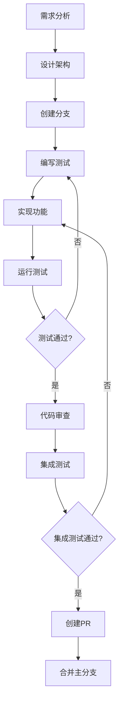

# 项目结构设计与开发流程

## 📖 概述

本文档详细规划PoE2智能构筑生成器的完整项目结构、文件组织和开发流程。确保项目具备企业级的组织性和可维护性。

## 🏗️ 完整项目结构

### 推荐的目录结构

```
poe2build/
├── README.md                          # 项目介绍和快速开始
├── CLAUDE.md                          # Claude Code指导文档
├── LICENSE                           # 开源许可证
├── .gitignore                        # Git忽略文件
├── requirements.txt                  # 生产环境依赖 (含psutil等PoB2依赖)
├── requirements-dev.txt             # 开发环境依赖
├── setup.py                         # 包设置文件
├── pyproject.toml                   # 现代Python项目配置
├── version.py                       # 版本管理
├── 
├── src/                             # 源代码目录
│   ├── __init__.py
│   ├── poe2build/                   # 主要包目录
│   │   ├── __init__.py
│   │   ├── core/                    # 核心业务逻辑
│   │   │   ├── __init__.py
│   │   │   ├── ai_orchestrator.py   # AI构筑推荐协调器
│   │   │   ├── build_generator.py   # AI构筑生成器
│   │   │   └── recommender.py       # 推荐引擎
│   │   ├── 
│   │   ├── data_sources/            # 数据源层
│   │   │   ├── __init__.py
│   │   │   ├── interfaces.py        # 数据源接口定义
│   │   │   ├── base_provider.py     # 基础数据提供者
│   │   │   ├── poe2_scout.py        # PoE2Scout API (市场数据)
│   │   │   ├── ninja_scraper.py     # poe.ninja爬虫 (Meta数据)
│   │   │   └── mock_provider.py     # 模拟数据提供者
│   │   ├── 
│   │   ├── pob2/                    # PoB2集成模块
│   │   │   ├── __init__.py
│   │   │   ├── local_client.py      # 本地PoB2客户端
│   │   │   ├── build_generator.py   # PoB2构筑生成器
│   │   │   ├── path_detector.py     # PoB2路径检测
│   │   │   ├── import_export.py     # PoB2导入导出
│   │   │   └── calculator.py        # PoB2计算接口
│   │   ├── 
│   │   ├── rag/                     # RAG智能训练模块
│   │   │   ├── __init__.py
│   │   │   ├── data_collector.py    # ninja.poe2数据采集器
│   │   │   ├── vectorizer.py        # 构筑数据向量化
│   │   │   ├── retrieval.py         # 相似构筑检索系统
│   │   │   ├── ai_enhanced.py       # RAG增强AI引擎
│   │   │   └── update_scheduler.py  # 知识库更新调度
│   │   ├── 
│   │   ├── models/                  # 数据模型
│   │   │   ├── __init__.py
│   │   │   ├── build.py             # 构筑数据模型
│   │   │   ├── items.py             # 物品数据模型
│   │   │   ├── skills.py            # 技能数据模型
│   │   │   ├── characters.py        # 角色数据模型
│   │   │   └── market.py            # 市场数据模型
│   │   ├── 
│   │   ├── resilience/              # 弹性架构组件
│   │   │   ├── __init__.py
│   │   │   ├── circuit_breaker.py   # 断路器模式
│   │   │   ├── rate_limiter.py      # 限流器
│   │   │   ├── retry_handler.py     # 重试处理
│   │   │   └── health_check.py      # 健康检查
│   │   ├── 
│   │   ├── utils/                   # 工具函数
│   │   │   ├── __init__.py
│   │   │   ├── cache.py             # 缓存工具
│   │   │   ├── logger.py            # 日志系统
│   │   │   ├── profiler.py          # 性能分析
│   │   │   ├── validators.py        # 数据验证
│   │   │   └── formatters.py        # 格式化工具
│   │   ├── 
│   │   └── config/                  # 配置文件
│   │       ├── __init__.py
│   │       ├── settings.py          # 应用配置
│   │       ├── constants.py         # PoE2常量定义
│   │       └── data_sources.py      # 数据源配置
│   
├── tests/                           # 测试目录（与生产代码分离）
│   ├── __init__.py
│   ├── conftest.py                  # pytest配置
│   ├── fixtures/                    # 测试数据
│   │   ├── sample_builds.json
│   │   ├── sample_market_data.json
│   │   └── mock_responses/
│   │       ├── poe2scout_response.json
│   │       ├── poe2db_response.html
│   │       └── ninja_response.json
│   ├── 
│   ├── unit/                        # 单元测试
│   │   ├── __init__.py
│   │   ├── test_orchestrator.py
│   │   ├── test_calculator.py
│   │   ├── test_data_sources.py
│   │   ├── test_models.py
│   │   ├── test_resilience.py
│   │   └── test_utils.py
│   ├── 
│   ├── integration/                 # 集成测试
│   │   ├── __init__.py
│   │   ├── test_full_workflow.py
│   │   ├── test_data_source_integration.py
│   │   └── test_api_endpoints.py
│   ├── 
│   ├── performance/                 # 性能测试
│   │   ├── __init__.py
│   │   ├── test_benchmarks.py
│   │   └── test_load.py
│   └── 
│   └── e2e/                         # 端到端测试
│       ├── __init__.py
│       └── test_user_scenarios.py
│   
├── docs/                            # 文档目录
│   ├── README.md                    # 文档索引
│   ├── 01_real_architecture.md      # 架构设计
│   ├── 02_poe2_data_sources.md      # 数据源文档
│   ├── 03_poe2_calculator.md        # 计算引擎文档
│   ├── 04_api_usage.md              # API使用说明
│   ├── 05_developer_guide.md        # 开发者指南
│   ├── 06_deployment.md             # 部署指南
│   ├── 07_troubleshooting.md        # 故障排除
│   ├── 08_project_structure.md      # 本文档
│   ├── 09_development_workflow.md   # 开发流程
│   ├── 10_testing_strategy.md       # 测试策略
│   └── api/                         # API文档
│       ├── interfaces.md
│       ├── data_models.md
│       └── examples.md
│   
├── scripts/                         # 脚本目录
│   ├── setup_dev.py                # 开发环境设置脚本
│   ├── run_tests.py                # 测试运行脚本
│   ├── build_package.py            # 打包脚本
│   └── deploy.py                   # 部署脚本
│   
├── config/                          # 配置文件目录
│   ├── development.yaml            # 开发环境配置
│   ├── production.yaml             # 生产环境配置
│   └── testing.yaml                # 测试环境配置
│   
├── data/                           # 数据文件目录
│   ├── cache/                      # 缓存数据
│   ├── rag/                        # RAG知识库数据
│   │   ├── poe2_rag_system.pkl     # 训练好的RAG向量数据库
│   │   ├── build_vectors.npy       # 构筑向量数据
│   │   ├── ninja_builds_raw.json   # poe.ninja原始数据
│   │   └── meta_trends.json        # Meta趋势分析数据
│   ├── static/                     # 静态数据
│   │   ├── poe2_constants.json
│   │   └── skill_mappings.json
│   └── samples/                    # 示例数据
│       ├── example_builds.json
│       └── example_requests.json
│   
├── tools/                          # 开发工具
│   ├── data_migration.py          # 数据迁移工具
│   ├── performance_profiler.py    # 性能分析工具
│   ├── api_monitor.py              # API监控工具
│   └── rag_trainer.py              # RAG系统训练和更新工具
│   
├── .github/                        # GitHub配置
│   ├── workflows/                  # CI/CD工作流
│   │   ├── ci.yml                  # 持续集成
│   │   ├── cd.yml                  # 持续部署
│   │   └── security.yml            # 安全扫描
│   ├── ISSUE_TEMPLATE/
│   └── PULL_REQUEST_TEMPLATE.md
│   
├── .vscode/                        # VS Code配置
│   ├── settings.json
│   ├── launch.json
│   └── tasks.json
│   
└── logs/                           # 日志目录
    ├── debug.log
    ├── error.log
    └── performance.log
```

## 📋 核心配置文件

### 1. pyproject.toml - 现代Python项目配置

```toml
[build-system]
requires = ["setuptools>=61.0", "wheel"]
build-backend = "setuptools.build_meta"

[project]
name = "poe2-build-generator"
version = "2.0.0"
description = "智能Path of Exile 2构筑生成器"
readme = "README.md"
license = {file = "LICENSE"}
authors = [
    {name = "PoE2 Build Generator Team", email = "dev@poe2build.com"}
]
classifiers = [
    "Development Status :: 4 - Beta",
    "Intended Audience :: End Users/Desktop",
    "License :: OSI Approved :: MIT License",
    "Programming Language :: Python :: 3",
    "Programming Language :: Python :: 3.8",
    "Programming Language :: Python :: 3.9",
    "Programming Language :: Python :: 3.10",
    "Programming Language :: Python :: 3.11",
    "Topic :: Games/Entertainment",
]
requires-python = ">=3.8"
dependencies = [
    "requests>=2.31.0",
    "beautifulsoup4>=4.12.0",
    "pydantic>=2.0.0",
    "aiohttp>=3.8.0",
    "pyyaml>=6.0",
]

[project.optional-dependencies]
dev = [
    "pytest>=7.4.0",
    "pytest-asyncio>=0.21.0",
    "pytest-cov>=4.1.0",
    "black>=23.0.0",
    "flake8>=6.0.0",
    "mypy>=1.5.0",
    "pre-commit>=3.3.0",
    "sphinx>=7.0.0",
]
test = [
    "pytest>=7.4.0",
    "pytest-asyncio>=0.21.0",
    "pytest-cov>=4.1.0",
    "responses>=0.23.0",
]

[project.scripts]
poe2build = "poe2build.cli:main"

[tool.black]
line-length = 88
target-version = ['py38', 'py39', 'py310', 'py311']
include = '\\.pyi?$'
extend-exclude = '''
/(
  # directories
  \\.eggs
  | \\.git
  | \\.hg
  | \\.mypy_cache
  | \\.tox
  | \\.venv
  | build
  | dist
)/
'''

[tool.mypy]
python_version = "3.8"
warn_return_any = true
warn_unused_configs = true
disallow_untyped_defs = true
disallow_incomplete_defs = true
check_untyped_defs = true
disallow_untyped_decorators = true
no_implicit_optional = true
warn_redundant_casts = true
warn_unused_ignores = true
warn_no_return = true
warn_unreachable = true
strict_equality = true

[tool.pytest.ini_options]
minversion = "7.0"
addopts = "-ra -q --strict-markers --strict-config"
testpaths = [
    "tests",
]
markers = [
    "slow: marks tests as slow (deselect with '-m \"not slow\"')",
    "integration: marks tests as integration tests",
    "e2e: marks tests as end-to-end tests",
    "unit: marks tests as unit tests",
]

[tool.coverage.run]
source = ["src/poe2build"]
omit = [
    "tests/*",
    "src/poe2build/config/*",
]

[tool.coverage.report]
exclude_lines = [
    "pragma: no cover",
    "def __repr__",
    "if self.debug:",
    "if settings.DEBUG",
    "raise AssertionError",
    "raise NotImplementedError",
    "if 0:",
    "if __name__ == .__main__.:",
    "class .*\\bProtocol\\):",
    "@(abc\\.)?abstractmethod",
]
```

### 2. requirements.txt - 生产依赖

```txt
# Core dependencies
requests>=2.31.0,<3.0.0
beautifulsoup4>=4.12.0,<5.0.0
pydantic>=2.0.0,<3.0.0
aiohttp>=3.8.0,<4.0.0
pyyaml>=6.0,<7.0

# Optional performance enhancements
lxml>=4.9.0,<5.0.0
ujson>=5.8.0,<6.0.0
```

### 3. requirements-dev.txt - 开发依赖

```txt
# Include production dependencies
-r requirements.txt

# Development tools
pytest>=7.4.0
pytest-asyncio>=0.21.0
pytest-cov>=4.1.0
pytest-mock>=3.11.0
responses>=0.23.0

# Code quality
black>=23.0.0
flake8>=6.0.0
mypy>=1.5.0
pre-commit>=3.3.0
isort>=5.12.0

# Documentation
sphinx>=7.0.0
sphinx-rtd-theme>=1.3.0
myst-parser>=2.0.0

# Profiling and monitoring
memory-profiler>=0.61.0
line-profiler>=4.1.0

# Development utilities
ipython>=8.14.0
ipdb>=0.13.0
```

## 🔧 开发环境配置文件

### 1. .env.example - 环境变量模板

```env
# PoE2 Build Generator Environment Configuration

# Application Settings
POE2_DEBUG=true
POE2_LOG_LEVEL=DEBUG
POE2_CACHE_TTL=3600

# Data Source Settings
POE2_SCOUT_BASE_URL=https://poe2scout.com
POE2_DB_BASE_URL=https://poe2db.tw
POE2_NINJA_BASE_URL=https://poe.ninja/poe2

# Rate Limiting
POE2_SCOUT_RATE_LIMIT=30
POE2_DB_RATE_LIMIT=20
POE2_NINJA_RATE_LIMIT=10

# Circuit Breaker Settings
CIRCUIT_BREAKER_FAILURE_THRESHOLD=5
CIRCUIT_BREAKER_RECOVERY_TIMEOUT=60

# Cache Settings
CACHE_BACKEND=memory
CACHE_DIR=./data/cache
CACHE_MAX_SIZE=100

# Logging
LOG_DIR=./logs
LOG_FORMAT=%(asctime)s - %(name)s - %(levelname)s - %(message)s
```

### 2. .gitignore

```gitignore
# Python
__pycache__/
*.py[cod]
*$py.class
*.so
.Python
build/
develop-eggs/
dist/
downloads/
eggs/
.eggs/
lib/
lib64/
parts/
sdist/
var/
wheels/
*.egg-info/
.installed.cfg
*.egg
MANIFEST

# Virtual environments
.env
.venv
env/
venv/
ENV/
env.bak/
venv.bak/

# IDEs
.vscode/
.idea/
*.swp
*.swo
*~

# Testing
.coverage
.pytest_cache/
htmlcov/
.tox/
.nox/

# Logs
*.log
logs/
*.log.*

# Cache and temporary files
.cache/
data/cache/
*.tmp
*.bak

# OS
.DS_Store
.DS_Store?
._*
.Spotlight-V100
.Trashes
ehthumbs.db
Thumbs.db

# Project specific
config/local.yaml
config/secrets.yaml
data/private/
```

### 3. .pre-commit-config.yaml - Git钩子配置

```yaml
repos:
  - repo: https://github.com/pre-commit/pre-commit-hooks
    rev: v4.4.0
    hooks:
      - id: trailing-whitespace
      - id: end-of-file-fixer
      - id: check-yaml
      - id: check-json
      - id: check-added-large-files
      - id: check-merge-conflict
      - id: debug-statements

  - repo: https://github.com/psf/black
    rev: 23.7.0
    hooks:
      - id: black
        language_version: python3

  - repo: https://github.com/pycqa/flake8
    rev: 6.0.0
    hooks:
      - id: flake8
        additional_dependencies: [flake8-docstrings]

  - repo: https://github.com/pycqa/isort
    rev: 5.12.0
    hooks:
      - id: isort
        args: ["--profile", "black"]

  - repo: https://github.com/pre-commit/mirrors-mypy
    rev: v1.5.1
    hooks:
      - id: mypy
        additional_dependencies: [types-requests, types-PyYAML]
```

## 📊 测试文件组织

### 1. tests/conftest.py - 测试配置

```python
\"\"\"pytest配置和通用fixture\"\"\"
import pytest
import json
from pathlib import Path
from unittest.mock import Mock, patch

from poe2build.core.orchestrator import PoE2RealDataOrchestrator
from poe2build.data_sources.mock_provider import MockDataProvider


@pytest.fixture
def sample_builds():
    \"\"\"加载示例构筑数据\"\"\"
    fixtures_path = Path(__file__).parent / "fixtures" / "sample_builds.json"
    with open(fixtures_path, "r", encoding="utf-8") as f:
        return json.load(f)


@pytest.fixture
def sample_market_data():
    \"\"\"加载示例市场数据\"\"\"
    fixtures_path = Path(__file__).parent / "fixtures" / "sample_market_data.json"
    with open(fixtures_path, "r", encoding="utf-8") as f:
        return json.load(f)


@pytest.fixture
def mock_orchestrator():
    \"\"\"创建模拟的协调器\"\"\"
    with patch('poe2build.data_sources.poe2_scout.PoE2ScoutAPI') as mock_scout, \\
         patch('poe2build.data_sources.poe2db_scraper.PoE2DBScraper') as mock_db, \\
         patch('poe2build.data_sources.ninja_scraper.PoE2NinjaScraper') as mock_ninja:
        
        # 配置模拟返回值
        mock_scout.return_value.get_market_data.return_value = {"status": "success"}
        mock_db.return_value.get_skill_data.return_value = {"skills": []}
        mock_ninja.return_value.get_popular_builds.return_value = []
        
        yield PoE2RealDataOrchestrator()


@pytest.fixture
def test_user_request():
    \"\"\"标准的用户请求\"\"\"
    return {
        'game': 'poe2',
        'mode': 'standard',
        'preferences': {
            'class': 'Ranger',
            'ascendancy': 'Deadeye',
            'style': 'bow',
            'goal': 'endgame_content',
            'budget': {
                'amount': 15, 
                'currency': 'divine'
            }
        }
    }


@pytest.fixture(scope="session")
def test_config():
    \"\"\"测试环境配置\"\"\"
    return {
        'cache_ttl': 60,  # 短缓存时间用于测试
        'rate_limits': {
            'test': {'requests_per_minute': 1000}  # 测试时不限流
        },
        'circuit_breaker': {
            'failure_threshold': 3,
            'recovery_timeout': 5
        }
    }
```

### 2. tests/unit/test_orchestrator.py - 核心组件单元测试

```python
\"\"\"协调器单元测试\"\"\"
import pytest
from unittest.mock import Mock, patch, AsyncMock

from poe2build.core.orchestrator import PoE2RealDataOrchestrator
from poe2build.models.build import PoE2Build
from poe2build.models.characters import PoE2CharacterClass


class TestPoE2RealDataOrchestrator:
    \"\"\"测试PoE2数据协调器\"\"\"
    
    def test_initialization(self):
        \"\"\"测试初始化\"\"\"
        orchestrator = PoE2RealDataOrchestrator()
        
        assert orchestrator is not None
        assert hasattr(orchestrator, 'poe2_scout')
        assert hasattr(orchestrator, 'poe2db')
        assert hasattr(orchestrator, 'poe2_ninja')
        assert hasattr(orchestrator, 'calculator')
    
    @patch('poe2build.data_sources.poe2_scout.PoE2ScoutAPI')
    def test_market_data_integration(self, mock_scout):
        \"\"\"测试市场数据集成\"\"\"
        # 配置模拟
        mock_scout.return_value.get_market_data.return_value = {
            'status': 'success',
            'data': {'popular_items': ['Divine Orb', 'Exalted Orb']}
        }
        
        orchestrator = PoE2RealDataOrchestrator()
        result = orchestrator._get_market_data()
        
        assert result['status'] == 'success'
        assert 'popular_items' in result['data']
    
    def test_build_filtering_by_class(self, mock_orchestrator, sample_builds):
        \"\"\"测试按职业过滤构筑\"\"\"
        filtered = mock_orchestrator._filter_builds_by_class(
            sample_builds, 
            PoE2CharacterClass.RANGER
        )
        
        for build in filtered:
            assert build['class'] == 'Ranger'
    
    def test_build_filtering_by_budget(self, mock_orchestrator, sample_builds):
        \"\"\"测试按预算过滤构筑\"\"\"
        budget_limit = 10  # divine orbs
        filtered = mock_orchestrator._filter_builds_by_budget(
            sample_builds, 
            budget_limit
        )
        
        for build in filtered:
            assert build.get('estimated_cost', 0) <= budget_limit
    
    @pytest.mark.asyncio
    async def test_concurrent_data_fetching(self, mock_orchestrator):
        \"\"\"测试并发数据获取\"\"\"
        user_request = {
            'preferences': {
                'class': 'Ranger',
                'style': 'bow'
            }
        }
        
        # 测试并发执行
        result = await mock_orchestrator._fetch_all_data_concurrent(user_request)
        
        assert 'market_data' in result
        assert 'builds_data' in result
        assert 'game_data' in result
    
    def test_recommendation_generation(self, mock_orchestrator, test_user_request):
        \"\"\"测试推荐生成\"\"\"
        result = mock_orchestrator.create_poe2_build_recommendation(test_user_request)
        
        # 验证结果结构
        assert 'recommendations' in result
        assert 'metadata' in result
        assert isinstance(result['recommendations'], list)
        
        # 验证每个推荐包含必要信息
        if result['recommendations']:
            rec = result['recommendations'][0]
            assert 'build_name' in rec
            assert 'stats' in rec
            assert 'estimated_cost' in rec
```

## 🚀 开发流程规范

### 1. 功能开发流程



### 2. Git分支策略

```bash
# 主分支
main            # 生产环境稳定版本
develop         # 开发集成分支

# 功能分支
feature/        # 新功能开发
├── feature/interface-based-architecture
├── feature/circuit-breaker
└── feature/advanced-calculator

# 修复分支  
fix/           # Bug修复
hotfix/        # 紧急修复

# 发布分支
release/       # 发布准备
```

### 3. 开发环境设置自动化脚本

```python
# scripts/setup_dev.py
\"\"\"开发环境自动化设置脚本\"\"\"
import os
import sys
import subprocess
from pathlib import Path


def run_command(command: str, description: str) -> bool:
    \"\"\"执行命令并显示进度\"\"\"
    print(f\"\\n📦 {description}...\")
    try:
        result = subprocess.run(command, shell=True, check=True, capture_output=True, text=True)
        print(f\"✅ {description} 完成\")
        return True
    except subprocess.CalledProcessError as e:
        print(f\"❌ {description} 失败: {e.stderr}\")
        return False


def setup_development_environment():
    \"\"\"设置开发环境\"\"\"
    print(\"🚀 PoE2 Build Generator - 开发环境设置\")
    
    # 检查Python版本
    if sys.version_info < (3, 8):
        print(\"❌ 需要Python 3.8或更高版本\")
        sys.exit(1)
    
    print(f\"✅ Python版本: {sys.version}\")
    
    # 创建虚拟环境
    if not run_command(\"python -m venv venv\", \"创建虚拟环境\"):
        return False
    
    # 激活虚拟环境并安装依赖
    if os.name == 'nt':  # Windows
        pip_path = \"venv\\\\Scripts\\\\pip\"
    else:  # Unix/Linux/macOS
        pip_path = \"venv/bin/pip\"
    
    if not run_command(f\"{pip_path} install -r requirements-dev.txt\", \"安装开发依赖\"):
        return False
    
    # 安装pre-commit钩子
    if not run_command(\"pre-commit install\", \"设置Git钩子\"):
        return False
    
    # 创建必要的目录
    directories = [
        \"data/cache\",
        \"logs\",
        \"data/static\",
        \"data/samples\"
    ]
    
    for directory in directories:
        Path(directory).mkdir(parents=True, exist_ok=True)
        print(f\"📁 创建目录: {directory}\")
    
    # 复制配置文件模板
    if not Path(\".env\").exists() and Path(\".env.example\").exists():
        import shutil
        shutil.copy(\".env.example\", \".env\")
        print(\"📝 创建 .env 配置文件\")
    
    print(\"\\n🎉 开发环境设置完成!\")
    print(\"\\n📋 接下来的步骤:\")
    print(\"   1. 激活虚拟环境: source venv/bin/activate (Linux/Mac) 或 venv\\\\Scripts\\\\activate (Windows)\")
    print(\"   2. 运行测试: python -m pytest tests/\")
    print(\"   3. 启动应用: python -m poe2build\")
    
    return True


if __name__ == \"__main__\":
    success = setup_development_environment()
    sys.exit(0 if success else 1)
```

### 4. 测试运行脚本

```python
# scripts/run_tests.py
\"\"\"测试运行和报告生成脚本\"\"\"
import subprocess
import sys
import argparse
from pathlib import Path


def run_unit_tests():
    \"\"\"运行单元测试\"\"\"
    print(\"🧪 运行单元测试...\")
    cmd = [\"python\", \"-m\", \"pytest\", \"tests/unit/\", \"-v\", \"--cov=src/poe2build\", \"--cov-report=html\"]
    return subprocess.run(cmd).returncode == 0


def run_integration_tests():
    \"\"\"运行集成测试\"\"\"
    print(\"🔗 运行集成测试...\")
    cmd = [\"python\", \"-m\", \"pytest\", \"tests/integration/\", \"-v\", \"-m\", \"integration\"]
    return subprocess.run(cmd).returncode == 0


def run_performance_tests():
    \"\"\"运行性能测试\"\"\"
    print(\"⚡ 运行性能测试...\")
    cmd = [\"python\", \"-m\", \"pytest\", \"tests/performance/\", \"-v\", \"-m\", \"slow\"]
    return subprocess.run(cmd).returncode == 0


def run_code_quality_checks():
    \"\"\"运行代码质量检查\"\"\"
    print(\"📏 运行代码质量检查...\")
    
    checks = [
        ([\"black\", \"--check\", \"src/\", \"tests/\"], \"代码格式检查\"),
        ([\"flake8\", \"src/\", \"tests/\"], \"代码风格检查\"),
        ([\"mypy\", \"src/poe2build/\"], \"类型检查\"),
    ]
    
    all_passed = True
    for cmd, description in checks:
        print(f\"  {description}...\")
        if subprocess.run(cmd).returncode != 0:
            all_passed = False
            print(f\"  ❌ {description}失败\")
        else:
            print(f\"  ✅ {description}通过\")
    
    return all_passed


def main():
    parser = argparse.ArgumentParser(description=\"PoE2构筑生成器测试套件\")
    parser.add_argument(\"--unit\", action=\"store_true\", help=\"只运行单元测试\")
    parser.add_argument(\"--integration\", action=\"store_true\", help=\"只运行集成测试\")
    parser.add_argument(\"--performance\", action=\"store_true\", help=\"只运行性能测试\")
    parser.add_argument(\"--quality\", action=\"store_true\", help=\"只运行代码质量检查\")
    parser.add_argument(\"--all\", action=\"store_true\", help=\"运行所有测试和检查\")
    
    args = parser.parse_args()
    
    if not any([args.unit, args.integration, args.performance, args.quality, args.all]):
        args.all = True  # 默认运行所有
    
    success = True
    
    if args.all or args.unit:
        success &= run_unit_tests()
    
    if args.all or args.integration:
        success &= run_integration_tests()
    
    if args.all or args.quality:
        success &= run_code_quality_checks()
    
    if args.performance:
        success &= run_performance_tests()
    
    if success:
        print(\"\\n🎉 所有测试通过!\")
        return 0
    else:
        print(\"\\n❌ 部分测试失败\")
        return 1


if __name__ == \"__main__\":
    sys.exit(main())
```

## 📝 文件内容模板

### 1. 模块初始化文件模板

```python
# src/poe2build/core/__init__.py
\"\"\"
PoE2构筑生成器核心模块

包含主要的业务逻辑组件:
- PoE2RealDataOrchestrator: 数据协调器
- PoE2RealBuildCalculator: 构筑计算引擎  
- PoE2RecommendationEngine: 推荐引擎
\"\"\"

from .orchestrator import PoE2RealDataOrchestrator
from .calculator import PoE2RealBuildCalculator
from .recommender import PoE2RecommendationEngine

__all__ = [
    \"PoE2RealDataOrchestrator\",
    \"PoE2RealBuildCalculator\", 
    \"PoE2RecommendationEngine\",
]

# 版本信息
__version__ = \"2.0.0\"
```

### 2. 数据模型模板

```python
# src/poe2build/models/build.py
\"\"\"PoE2构筑数据模型\"\"\"

from dataclasses import dataclass
from typing import Dict, List, Optional, Any
from enum import Enum

from .characters import PoE2CharacterClass
from .items import PoE2Item
from .skills import PoE2Skill


class PoE2BuildGoal(Enum):
    \"\"\"构筑目标\"\"\"
    CLEAR_SPEED = \"clear_speed\"
    BOSS_KILLING = \"boss_killing\"
    ENDGAME_CONTENT = \"endgame_content\"
    LEAGUE_START = \"league_start\"
    BUDGET_FRIENDLY = \"budget_friendly\"


@dataclass
class PoE2BuildStats:
    \"\"\"构筑统计数据\"\"\"
    total_dps: float
    effective_health_pool: float
    fire_resistance: int
    cold_resistance: int
    lightning_resistance: int
    chaos_resistance: int
    energy_shield: float
    life: float
    
    def __post_init__(self):
        \"\"\"验证数据\"\"\"
        # 确保抗性在合理范围内
        for resistance in [self.fire_resistance, self.cold_resistance, self.lightning_resistance]:
            if not -100 <= resistance <= 80:  # PoE2最大80%抗性
                raise ValueError(f\"Resistance value {resistance} out of range [-100, 80]\")


@dataclass 
class PoE2Build:
    \"\"\"PoE2构筑数据模型\"\"\"
    name: str
    character_class: PoE2CharacterClass
    ascendancy: Optional[str]
    level: int
    main_skill: PoE2Skill
    support_skills: List[PoE2Skill]
    items: Dict[str, PoE2Item]
    stats: Optional[PoE2BuildStats] = None
    estimated_cost: Optional[float] = None
    goal: Optional[PoE2BuildGoal] = None
    notes: Optional[str] = None
    
    def __post_init__(self):
        \"\"\"验证构筑数据\"\"\"
        if not 1 <= self.level <= 100:
            raise ValueError(f\"Level {self.level} must be between 1 and 100\")
        
        if not self.name.strip():
            raise ValueError(\"Build name cannot be empty\")
    
    def validate(self) -> bool:
        \"\"\"验证构筑完整性\"\"\"
        try:
            # 检查必要装备槽位
            required_slots = ['weapon', 'armor']
            for slot in required_slots:
                if slot not in self.items:
                    return False
            
            # 检查统计数据
            if self.stats:
                if self.stats.total_dps <= 0:
                    return False
            
            return True
        except Exception:
            return False
    
    def to_dict(self) -> Dict[str, Any]:
        \"\"\"转换为字典\"\"\"
        return {
            'name': self.name,
            'class': self.character_class.value,
            'ascendancy': self.ascendancy,
            'level': self.level,
            'main_skill': self.main_skill.to_dict(),
            'support_skills': [skill.to_dict() for skill in self.support_skills],
            'items': {slot: item.to_dict() for slot, item in self.items.items()},
            'stats': self.stats.__dict__ if self.stats else None,
            'estimated_cost': self.estimated_cost,
            'goal': self.goal.value if self.goal else None,
            'notes': self.notes
        }
    
    @classmethod
    def from_dict(cls, data: Dict[str, Any]) -> 'PoE2Build':
        \"\"\"从字典创建实例\"\"\"
        # 实现从字典数据重建对象的逻辑
        # 这里需要处理嵌套对象的反序列化
        pass
```

---

**总结**: 这个项目结构设计确保了代码的模块化、测试的完整性、以及开发流程的标准化。通过这样的组织结构，项目具备了企业级的可维护性和扩展性。