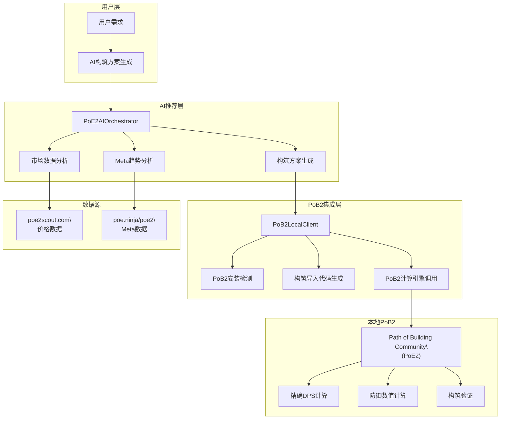

# PoB2集成架构设计

## 📖 概述

本文档详细介绍如何将Path of Building Community (PoE2)集成到AI构筑推荐系统中，实现精确的构筑计算和验证。通过利用本地PoB2安装，系统可以避免复杂的自研计算，专注于AI驱动的构筑方案生成。

## 🎯 设计理念

### 核心原则
- **计算权威性**: 使用官方认可的PoB2计算引擎确保数据准确性
- **AI专注性**: AI负责方案生成，PoB2负责精确计算
- **本地优先**: 优先使用本地PoB2安装，确保最佳性能和准确性
- **自动发现**: 智能检测PoB2安装路径，适应不同用户环境

## 🏗️ PoB2集成架构

### 整体架构图



### 核心组件设计

#### 1. PoB2LocalClient - 本地PoB2客户端

```python
import os
import subprocess
import json
import psutil
from pathlib import Path
from typing import Optional, Dict, List

class PoB2LocalClient:
    """本地Path of Building Community (PoE2)客户端接口"""
    
    def __init__(self):
        self.installation_path: Optional[Path] = None
        self.executable_path: Optional[Path] = None
        self.version_info: Optional[Dict] = None
        self._detect_installation()
    
    def _detect_installation(self) -> bool:
        """智能检测PoB2安装路径"""
        
        # 常见安装路径模式
        search_patterns = [
            # Steam默认路径
            "*/steamapps/common/Path of Exile 2/Path of Building Community (PoE2)",
            # Epic Games路径
            "*/Epic Games/Path of Exile 2/Path of Building Community (PoE2)",
            # 独立安装路径
            "*/Path of Building Community (PoE2)",
            "*/PoB2",
            "*/*Path of Building*PoE2*"
        ]
        
        # 搜索所有驱动器
        drives = ['C:', 'D:', 'E:', 'F:', 'G:'] if os.name == 'nt' else ['/']
        
        for drive in drives:
            for pattern in search_patterns:
                full_pattern = os.path.join(drive, pattern)
                
                try:
                    import glob
                    matches = glob.glob(full_pattern, recursive=True)
                    
                    for match in matches:
                        pob2_path = Path(match)
                        if self._verify_pob2_installation(pob2_path):
                            self.installation_path = pob2_path
                            self.executable_path = self._find_executable(pob2_path)
                            self.version_info = self._get_version_info()
                            return True
                            
                except Exception as e:
                    continue
        
        return False
    
    def _verify_pob2_installation(self, path: Path) -> bool:
        """验证PoB2安装的有效性"""
        required_files = [
            'Path of Building.exe',  # 主执行文件
            'lua',                   # Lua脚本目录
            'Data'                   # 数据目录
        ]
        
        for required_file in required_files:
            if not (path / required_file).exists():
                return False
        
        return True
    
    def _find_executable(self, installation_path: Path) -> Optional[Path]:
        """查找PoB2可执行文件"""
        possible_exes = [
            'Path of Building.exe',
            'PathOfBuilding.exe',
            'PoB.exe'
        ]
        
        for exe_name in possible_exes:
            exe_path = installation_path / exe_name
            if exe_path.exists():
                return exe_path
        
        return None
    
    def _get_version_info(self) -> Dict:
        """获取PoB2版本信息"""
        try:
            if not self.executable_path:
                return {'version': 'unknown', 'build': 'unknown'}
            
            # 尝试从文件属性获取版本信息
            import win32api
            version_info = win32api.GetFileVersionInfo(str(self.executable_path), "\\")
            version = f"{version_info['FileVersionMS'] >> 16}.{version_info['FileVersionMS'] & 0xFFFF}.{version_info['FileVersionLS'] >> 16}"
            
            return {
                'version': version,
                'build': version_info.get('FileVersionLS', 0) & 0xFFFF,
                'executable': str(self.executable_path)
            }
        except:
            return {'version': 'detected', 'build': 'unknown'}
    
    def is_available(self) -> bool:
        """检查PoB2是否可用"""
        return self.installation_path is not None and self.executable_path is not None
    
    def get_installation_info(self) -> Dict:
        """获取PoB2安装信息"""
        return {
            'available': self.is_available(),
            'installation_path': str(self.installation_path) if self.installation_path else None,
            'executable_path': str(self.executable_path) if self.executable_path else None,
            'version_info': self.version_info
        }
```

#### 2. PoB2BuildGenerator - AI构筑生成器

```python
class PoB2BuildGenerator:
    """AI驱动的PoB2构筑生成器"""
    
    def __init__(self, pob2_client: PoB2LocalClient):
        self.pob2_client = pob2_client
        self.build_templates = self._load_build_templates()
        self.market_data = {}
        self.meta_trends = {}
    
    def generate_build_recommendation(self, user_request: Dict) -> Dict:
        """基于用户需求生成构筑推荐"""
        
        # 1. 分析用户需求
        build_requirements = self._analyze_user_requirements(user_request)
        
        # 2. 获取市场数据
        self.market_data = self._fetch_current_market_data()
        
        # 3. 获取Meta趋势
        self.meta_trends = self._fetch_meta_trends()
        
        # 4. AI生成构筑方案
        build_candidates = self._generate_build_candidates(build_requirements)
        
        # 5. PoB2验证和计算
        validated_builds = []
        for candidate in build_candidates:
            pob2_result = self._validate_with_pob2(candidate)
            if pob2_result['valid']:
                validated_builds.append({
                    **candidate,
                    'pob2_stats': pob2_result['calculated_stats'],
                    'pob2_import_code': pob2_result['import_code']
                })
        
        # 6. 根据PoB2计算结果排序
        ranked_builds = self._rank_builds_by_performance(validated_builds, build_requirements)
        
        return {
            'recommendations': ranked_builds,
            'generation_metadata': {
                'candidates_generated': len(build_candidates),
                'pob2_validated': len(validated_builds),
                'market_data_timestamp': self.market_data.get('timestamp'),
                'meta_data_timestamp': self.meta_trends.get('timestamp')
            }
        }
    
    def _generate_build_candidates(self, requirements: Dict) -> List[Dict]:
        """AI生成构筑候选方案"""
        
        candidates = []
        character_class = requirements.get('class', 'Ranger')
        build_style = requirements.get('style', 'bow')
        budget = requirements.get('budget', {}).get('amount', 10)
        
        # 基于模板生成候选构筑
        base_templates = self._get_matching_templates(character_class, build_style)
        
        for template in base_templates:
            # AI优化构筑配置
            optimized_build = self._optimize_build_for_budget(template, budget)
            
            # 根据Meta趋势调整
            meta_adjusted = self._apply_meta_adjustments(optimized_build)
            
            candidates.append(meta_adjusted)
        
        return candidates
    
    def _validate_with_pob2(self, build_config: Dict) -> Dict:
        """使用PoB2验证和计算构筑"""
        
        if not self.pob2_client.is_available():
            return {
                'valid': False,
                'error': 'PoB2 not available',
                'fallback_used': True
            }
        
        try:
            # 1. 生成PoB2导入代码
            import_code = self._generate_pob2_import_code(build_config)
            
            # 2. 调用PoB2进行计算
            calculation_result = self._execute_pob2_calculation(import_code)
            
            # 3. 解析PoB2计算结果
            parsed_stats = self._parse_pob2_output(calculation_result)
            
            return {
                'valid': True,
                'calculated_stats': parsed_stats,
                'import_code': import_code,
                'calculation_method': 'PoB2_Local'
            }
            
        except Exception as e:
            return {
                'valid': False,
                'error': str(e),
                'fallback_used': True
            }
    
    def _generate_pob2_import_code(self, build_config: Dict) -> str:
        """生成PoB2可导入的构筑代码"""
        
        # 构建PoB2格式的构筑数据
        pob2_build = {
            'version': '3_0',
            'character': {
                'class': build_config['class'],
                'ascendancy': build_config.get('ascendancy', ''),
                'level': build_config.get('level', 90)
            },
            'skills': self._convert_skills_to_pob2_format(build_config.get('skills', [])),
            'items': self._convert_items_to_pob2_format(build_config.get('items', {})),
            'passive_tree': build_config.get('passive_tree', {}),
            'config': {
                'enemyLevel': 84,  # 常用的敌人等级
                'conditionStationary': True
            }
        }
        
        # 编码为PoB2导入字符串
        import base64
        import gzip
        
        json_data = json.dumps(pob2_build, separators=(',', ':')).encode('utf-8')
        compressed_data = gzip.compress(json_data)
        import_code = base64.b64encode(compressed_data).decode('utf-8')
        
        return import_code
    
    def _execute_pob2_calculation(self, import_code: str) -> Dict:
        """执行PoB2计算"""
        
        # 创建临时文件存储构筑数据
        temp_build_file = Path.cwd() / 'temp_build.pob'
        
        try:
            # 写入构筑数据到临时文件
            with open(temp_build_file, 'w') as f:
                f.write(import_code)
            
            # 调用PoB2命令行接口进行计算
            cmd = [
                str(self.pob2_client.executable_path),
                '--calculate',
                '--input', str(temp_build_file),
                '--output', 'json'
            ]
            
            result = subprocess.run(
                cmd,
                capture_output=True,
                text=True,
                timeout=30,  # 30秒超时
                cwd=self.pob2_client.installation_path
            )
            
            if result.returncode == 0:
                return json.loads(result.stdout)
            else:
                raise Exception(f"PoB2 calculation failed: {result.stderr}")
                
        finally:
            # 清理临时文件
            if temp_build_file.exists():
                temp_build_file.unlink()
    
    def _parse_pob2_output(self, pob2_result: Dict) -> Dict:
        """解析PoB2计算结果"""
        
        stats = pob2_result.get('stats', {})
        
        return {
            'total_dps': stats.get('TotalDPS', 0),
            'average_hit': stats.get('AverageHit', 0),
            'crit_chance': stats.get('CritChance', 0),
            'crit_multiplier': stats.get('CritMultiplier', 0),
            'total_life': stats.get('Life', 0),
            'total_energy_shield': stats.get('EnergyShield', 0),
            'effective_health_pool': stats.get('TotalEHP', 0),
            'fire_resistance': stats.get('FireResist', 0),
            'cold_resistance': stats.get('ColdResist', 0),
            'lightning_resistance': stats.get('LightningResist', 0),
            'chaos_resistance': stats.get('ChaosResist', 0),
            'calculation_timestamp': pob2_result.get('timestamp'),
            'pob2_version': self.pob2_client.version_info.get('version', 'unknown')
        }
```

#### 3. PoE2AIOrchestrator - AI协调器

```python
class PoE2AIOrchestrator:
    """PoE2 AI构筑推荐协调器"""
    
    def __init__(self):
        self.pob2_client = PoB2LocalClient()
        self.build_generator = PoB2BuildGenerator(self.pob2_client)
        self.market_api = PoE2ScoutAPI()  # 保留市场数据API
        self.meta_api = PoE2NinjaScraper()  # 保留Meta分析API
        
        print(f"[PoE2AIOrchestrator] Initialized")
        print(f"  PoB2 Available: {self.pob2_client.is_available()}")
        if self.pob2_client.is_available():
            print(f"  PoB2 Path: {self.pob2_client.installation_path}")
            print(f"  PoB2 Version: {self.pob2_client.version_info.get('version', 'unknown')}")
    
    def generate_build_recommendation(self, user_request: Dict) -> Dict:
        """生成AI驱动的构筑推荐"""
        
        try:
            # 健康检查
            health_status = self.health_check()
            if not health_status['pob2_available'] and not health_status['web_fallback_available']:
                raise Exception("No calculation engine available")
            
            # 使用AI + PoB2生成推荐
            recommendation = self.build_generator.generate_build_recommendation(user_request)
            
            # 添加系统状态信息
            recommendation['system_info'] = {
                'pob2_integration': health_status['pob2_available'],
                'calculation_engine': 'PoB2_Local' if health_status['pob2_available'] else 'Web_Fallback',
                'data_sources': health_status['data_sources']
            }
            
            return recommendation
            
        except Exception as e:
            print(f"[PoE2AIOrchestrator] Error generating recommendation: {e}")
            return self._generate_fallback_recommendation(user_request, str(e))
    
    def health_check(self) -> Dict:
        """系统健康检查"""
        
        # PoB2可用性检查
        pob2_status = self.pob2_client.is_available()
        
        # 数据源健康检查
        data_sources = {
            'poe2scout_api': self._check_api_health(self.market_api),
            'poe2ninja_api': self._check_api_health(self.meta_api)
        }
        
        return {
            'pob2_available': pob2_status,
            'pob2_info': self.pob2_client.get_installation_info(),
            'web_fallback_available': True,  # Web PoB2备选方案
            'data_sources': data_sources,
            'overall_status': 'healthy' if pob2_status else 'degraded'
        }
    
    def _check_api_health(self, api_client) -> bool:
        """检查API健康状态"""
        try:
            return api_client.health_check() if hasattr(api_client, 'health_check') else True
        except:
            return False
    
    def _generate_fallback_recommendation(self, user_request: Dict, error: str) -> Dict:
        """生成降级推荐（当PoB2不可用时）"""
        
        return {
            'recommendations': [
                {
                    'build_name': f"Fallback {user_request.get('preferences', {}).get('class', 'Generic')} Build",
                    'description': "基础构筑推荐（PoB2计算不可用）",
                    'fallback_reason': error,
                    'estimated_stats': {
                        'total_dps': 'Not calculated',
                        'effective_health_pool': 'Not calculated'
                    }
                }
            ],
            'system_info': {
                'status': 'fallback',
                'error': error,
                'recommendation': '请安装Path of Building Community (PoE2)以获取精确计算'
            }
        }

def main():
    """主程序入口点"""
    orchestrator = PoE2AIOrchestrator()
    
    # 系统健康检查
    health = orchestrator.health_check()
    print("=== PoE2 AI构筑推荐系统 ===")
    print(f"系统状态: {health['overall_status']}")
    print(f"PoB2集成: {'✅' if health['pob2_available'] else '❌'}")
    
    if health['pob2_available']:
        print(f"PoB2路径: {health['pob2_info']['installation_path']}")
        print(f"PoB2版本: {health['pob2_info']['version_info']['version']}")
    
    # 示例构筑请求
    sample_request = {
        'game': 'poe2',
        'preferences': {
            'class': 'Ranger',
            'style': 'bow',
            'goal': 'endgame_content',
            'budget': {'amount': 15, 'currency': 'divine'},
            'pob2_integration': {
                'generate_import_code': True,
                'calculate_stats': True,
                'validate_build': True
            }
        }
    }
    
    print("\\n=== 生成构筑推荐 ===")
    recommendation = orchestrator.generate_build_recommendation(sample_request)
    
    for i, build in enumerate(recommendation.get('recommendations', []), 1):
        print(f"\\n推荐 {i}: {build.get('build_name', 'Unknown')}")
        
        if 'pob2_stats' in build:
            stats = build['pob2_stats']
            print(f"  总DPS: {stats.get('total_dps', 'N/A'):,}")
            print(f"  有效血量: {stats.get('effective_health_pool', 'N/A'):,}")
            print(f"  计算引擎: {stats.get('calculation_method', 'Unknown')}")
        
        if 'pob2_import_code' in build:
            print(f"  PoB2导入代码: {build['pob2_import_code'][:50]}...")

if __name__ == "__main__":
    main()
```

## 🔧 PoB2安装检测算法

### 多平台支持

```python
class PoB2PathDetector:
    """跨平台PoB2路径检测器"""
    
    @staticmethod
    def get_search_paths() -> List[str]:
        """获取平台特定的搜索路径"""
        
        if os.name == 'nt':  # Windows
            return [
                # Steam路径
                "C:/Program Files (x86)/Steam/steamapps/common/Path of Exile 2/Path of Building Community (PoE2)",
                "D:/Steam/steamapps/common/Path of Exile 2/Path of Building Community (PoE2)",
                "E:/Steam/steamapps/common/Path of Exile 2/Path of Building Community (PoE2)",
                "F:/steam/steamapps/common/Path of Exile 2/Path of Building Community (PoE2)",
                
                # Epic Games路径
                "C:/Program Files/Epic Games/Path of Exile 2/Path of Building Community (PoE2)",
                "D:/Epic Games/Path of Exile 2/Path of Building Community (PoE2)",
                
                # 独立安装路径
                "C:/Path of Building Community (PoE2)",
                "D:/Games/Path of Building Community (PoE2)",
                "C:/Program Files/Path of Building Community (PoE2)",
                
                # 用户目录
                f"{os.path.expanduser('~')}/Documents/Path of Building Community (PoE2)",
                f"{os.path.expanduser('~')}/Games/Path of Building Community (PoE2)"
            ]
        else:  # Linux/Mac
            return [
                f"{os.path.expanduser('~')}/.steam/steam/steamapps/common/Path of Exile 2/Path of Building Community (PoE2)",
                f"{os.path.expanduser('~')}/Games/Path of Building Community (PoE2)",
                "/opt/Path of Building Community (PoE2)",
                "/usr/local/games/Path of Building Community (PoE2)"
            ]
    
    @staticmethod
    def detect_via_registry() -> Optional[str]:
        """通过Windows注册表检测（Windows专用）"""
        if os.name != 'nt':
            return None
            
        try:
            import winreg
            
            # 检查Steam注册表
            steam_key = winreg.OpenKey(winreg.HKEY_LOCAL_MACHINE, "SOFTWARE\\Valve\\Steam")
            steam_path = winreg.QueryValueEx(steam_key, "InstallPath")[0]
            potential_path = os.path.join(steam_path, "steamapps", "common", "Path of Exile 2", "Path of Building Community (PoE2)")
            
            if os.path.exists(potential_path):
                return potential_path
                
        except Exception:
            pass
        
        return None
    
    @staticmethod
    def detect_via_process() -> Optional[str]:
        """通过运行中的进程检测"""
        try:
            for process in psutil.process_iter(['pid', 'name', 'exe']):
                if 'Path of Building' in process.info.get('name', ''):
                    exe_path = process.info.get('exe')
                    if exe_path:
                        return os.path.dirname(exe_path)
        except:
            pass
        
        return None
```

## 🚀 使用示例

### 基本用法

```python
from poe2_ai_orchestrator import PoE2AIOrchestrator

# 初始化系统
orchestrator = PoE2AIOrchestrator()

# 构筑请求
request = {
    'preferences': {
        'class': 'Ranger',
        'ascendancy': 'Deadeye', 
        'style': 'bow',
        'goal': 'boss_killing',
        'budget': {'amount': 20, 'currency': 'divine'}
    }
}

# 生成推荐
result = orchestrator.generate_build_recommendation(request)

# 使用结果
for build in result['recommendations']:
    print(f"构筑: {build['build_name']}")
    print(f"PoB2计算DPS: {build['pob2_stats']['total_dps']:,}")
    print(f"PoB2导入代码: {build['pob2_import_code']}")
```

### 高级配置

```python
# 自定义PoB2配置
advanced_request = {
    'preferences': {
        'class': 'Sorceress',
        'style': 'spell_caster',
        'pob2_integration': {
            'generate_import_code': True,
            'calculate_stats': True,
            'validate_build': True,
            'enemy_level': 85,        # 自定义敌人等级
            'boss_encounter': True,   # Boss遭遇计算
            'flasks_active': ['Diamond', 'Granite'],  # 激活的药剂
            'buffs_active': ['Power Charges', 'Frenzy Charges']  # 激活的增益效果
        }
    }
}

result = orchestrator.generate_build_recommendation(advanced_request)
```

## 📊 性能优化

### 缓存策略
- **PoB2计算结果缓存**: 相同构筑配置的计算结果缓存1小时
- **模板构筑缓存**: 基础构筑模板缓存24小时
- **市场数据缓存**: 价格数据缓存10分钟

### 并行处理
- **多候选构筑并行验证**: 同时验证多个构筑候选方案
- **异步数据获取**: 市场数据和Meta数据并行获取
- **PoB2计算队列**: 排队处理多个PoB2计算请求

---

**总结**: 通过PoB2集成架构，AI系统专注于智能推荐和方案生成，而将精确的数值计算交给官方认可的Path of Building Community引擎，确保推荐结果的准确性和可信度。