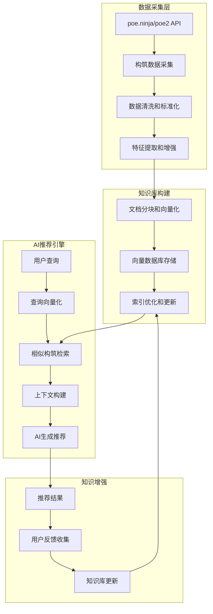

# RAG-AI构筑推荐系统

## 📖 概述

本文档介绍如何使用poe.ninja/poe2的真实构筑数据训练RAG(Retrieval-Augmented Generation)系统，让AI基于最新的Meta数据和成功构筑案例生成更精准的推荐。

## 🎯 RAG架构设计理念

### 核心思想
- **数据驱动**: 基于poe.ninja/poe2的真实玩家构筑数据
- **动态学习**: 持续采集最新Meta趋势和构筑演进
- **检索增强**: AI推荐前先检索相似成功构筑案例
- **上下文感知**: 结合市场价格、流行度、成功率等多维度信息

### RAG工作流程


## 🏗️ RAG系统架构

### 核心组件设计

#### 1. PoE2NinjaRAGCollector - 数据采集器

```python
import requests
import json
from datetime import datetime, timedelta
from typing import Dict, List, Optional
import asyncio
import aiohttp
from dataclasses import dataclass

@dataclass
class PoE2BuildData:
    """PoE2构筑数据结构"""
    character_name: str
    character_class: str
    ascendancy: str
    level: int
    main_skill: str
    support_gems: List[str]
    weapon_type: str
    key_items: List[str]
    passive_keystone: List[str]
    dps: float
    life: int
    energy_shield: int
    total_cost: float
    popularity_rank: int
    success_metrics: Dict
    timestamp: datetime

class PoE2NinjaRAGCollector:
    """poe.ninja/poe2数据采集和RAG知识库构建"""
    
    def __init__(self):
        self.base_url = "https://poe.ninja/poe2/builds"
        self.api_endpoints = {
            'builds': "https://poe.ninja/api/data/poe2buildsoverview",
            'characters': "https://poe.ninja/api/data/poe2characters",
            'items': "https://poe.ninja/api/data/poe2items"
        }
        self.session = aiohttp.ClientSession()
        self.collected_builds = []
        self.meta_trends = {}
        
    async def collect_comprehensive_build_data(self) -> List[PoE2BuildData]:
        """采集全面的构筑数据用于RAG训练"""
        
        print("[RAG Collector] 开始采集poe.ninja/poe2构筑数据...")
        
        # 1. 采集热门构筑数据
        popular_builds = await self._fetch_popular_builds()
        
        # 2. 采集不同职业的构筑分布
        class_distribution = await self._fetch_class_distribution()
        
        # 3. 采集技能流行度数据
        skill_meta = await self._fetch_skill_meta()
        
        # 4. 采集装备和价格趋势
        item_trends = await self._fetch_item_trends()
        
        # 5. 构建详细的构筑数据集
        comprehensive_builds = await self._build_comprehensive_dataset(
            popular_builds, class_distribution, skill_meta, item_trends
        )
        
        print(f"[RAG Collector] 采集完成，总计 {len(comprehensive_builds)} 个构筑样本")
        return comprehensive_builds
    
    async def _fetch_popular_builds(self) -> List[Dict]:
        """获取热门构筑数据"""
        try:
            async with self.session.get(
                self.api_endpoints['builds'],
                params={'league': 'poe2-standard', 'limit': 1000}
            ) as response:
                if response.status == 200:
                    data = await response.json()
                    return data.get('builds', [])
                else:
                    print(f"[RAG Collector] API错误: {response.status}")
                    return []
        except Exception as e:
            print(f"[RAG Collector] 采集错误: {e}")
            return []
    
    async def _build_comprehensive_dataset(
        self, 
        builds: List[Dict], 
        class_dist: Dict,
        skill_meta: Dict, 
        item_trends: Dict
    ) -> List[PoE2BuildData]:
        """构建综合数据集"""
        
        comprehensive_builds = []
        
        for i, build in enumerate(builds):
            try:
                # 提取构筑核心信息
                build_data = PoE2BuildData(
                    character_name=build.get('name', f'Build_{i}'),
                    character_class=build.get('class', 'Unknown'),
                    ascendancy=build.get('ascendancy', ''),
                    level=build.get('level', 85),
                    main_skill=self._extract_main_skill(build),
                    support_gems=self._extract_support_gems(build),
                    weapon_type=self._extract_weapon_type(build),
                    key_items=self._extract_key_items(build),
                    passive_keystone=self._extract_keystones(build),
                    dps=build.get('dps', 0),
                    life=build.get('life', 0),
                    energy_shield=build.get('energy_shield', 0),
                    total_cost=self._calculate_build_cost(build, item_trends),
                    popularity_rank=i + 1,
                    success_metrics=self._calculate_success_metrics(build, skill_meta),
                    timestamp=datetime.now()
                )
                
                comprehensive_builds.append(build_data)
                
            except Exception as e:
                print(f"[RAG Collector] 处理构筑 {i} 时出错: {e}")
                continue
        
        return comprehensive_builds
    
    def _extract_main_skill(self, build: Dict) -> str:
        """提取主要技能"""
        skills = build.get('skills', [])
        if skills:
            # 通常第一个技能是主要技能
            main_skill_group = skills[0]
            return main_skill_group.get('skill', {}).get('name', 'Unknown')
        return 'Unknown'
    
    def _extract_support_gems(self, build: Dict) -> List[str]:
        """提取辅助宝石"""
        support_gems = []
        skills = build.get('skills', [])
        
        for skill_group in skills:
            supports = skill_group.get('supports', [])
            for support in supports:
                gem_name = support.get('name', '')
                if gem_name and gem_name not in support_gems:
                    support_gems.append(gem_name)
        
        return support_gems
    
    def _calculate_success_metrics(self, build: Dict, skill_meta: Dict) -> Dict:
        """计算构筑成功指标"""
        main_skill = self._extract_main_skill(build)
        
        return {
            'skill_popularity': skill_meta.get(main_skill, {}).get('usage_rate', 0),
            'level_achievement': min(build.get('level', 85) / 100.0, 1.0),
            'gear_quality': self._assess_gear_quality(build),
            'build_completeness': self._assess_completeness(build),
            'meta_alignment': self._assess_meta_alignment(build, skill_meta)
        }
```

#### 2. PoE2RAGVectorizer - 向量化系统

```python
from sentence_transformers import SentenceTransformer
import numpy as np
from typing import List, Dict
import faiss
import pickle

class PoE2RAGVectorizer:
    """PoE2构筑数据向量化和相似度检索"""
    
    def __init__(self, model_name: str = "all-MiniLM-L6-v2"):
        self.model = SentenceTransformer(model_name)
        self.vector_dimension = 384  # MiniLM模型维度
        self.faiss_index = None
        self.build_database = []
        self.build_vectors = []
        
    def vectorize_build_data(self, builds: List[PoE2BuildData]) -> np.ndarray:
        """将构筑数据向量化"""
        
        print(f"[RAG Vectorizer] 开始向量化 {len(builds)} 个构筑...")
        
        build_descriptions = []
        
        for build in builds:
            # 构建构筑的文本描述
            description = self._build_text_description(build)
            build_descriptions.append(description)
        
        # 使用Sentence Transformer进行向量化
        vectors = self.model.encode(build_descriptions)
        
        print(f"[RAG Vectorizer] 向量化完成，维度: {vectors.shape}")
        return vectors
    
    def _build_text_description(self, build: PoE2BuildData) -> str:
        """构建构筑的文本描述用于向量化"""
        
        # 构建综合的文本描述
        description_parts = [
            f"Character: {build.character_class}",
            f"Ascendancy: {build.ascendancy}" if build.ascendancy else "",
            f"Level: {build.level}",
            f"Main Skill: {build.main_skill}",
            f"Support Gems: {', '.join(build.support_gems[:5])}" if build.support_gems else "",
            f"Weapon Type: {build.weapon_type}",
            f"Key Items: {', '.join(build.key_items[:3])}" if build.key_items else "",
            f"Keystones: {', '.join(build.passive_keystone[:3])}" if build.passive_keystone else "",
            f"DPS: {build.dps:,.0f}" if build.dps > 0 else "",
            f"Life: {build.life}" if build.life > 0 else "",
            f"Energy Shield: {build.energy_shield}" if build.energy_shield > 0 else "",
            f"Cost: {build.total_cost:.1f} divine" if build.total_cost > 0 else "",
            f"Popularity Rank: {build.popularity_rank}",
            f"Success Score: {build.success_metrics.get('build_completeness', 0):.2f}"
        ]
        
        # 过滤空字符串并连接
        description = " | ".join([part for part in description_parts if part])
        
        return description
    
    def build_faiss_index(self, vectors: np.ndarray) -> faiss.Index:
        """构建FAISS索引用于快速相似度检索"""
        
        print("[RAG Vectorizer] 构建FAISS索引...")
        
        # 使用FAISS IndexFlatIP (内积)进行相似度检索
        index = faiss.IndexFlatIP(self.vector_dimension)
        
        # 标准化向量
        faiss.normalize_L2(vectors)
        
        # 添加向量到索引
        index.add(vectors.astype(np.float32))
        
        self.faiss_index = index
        self.build_vectors = vectors
        
        print(f"[RAG Vectorizer] FAISS索引构建完成，包含 {index.ntotal} 个向量")
        return index
    
    def search_similar_builds(
        self, 
        query_description: str, 
        top_k: int = 10
    ) -> List[tuple]:
        """搜索相似构筑"""
        
        if self.faiss_index is None:
            raise ValueError("FAISS索引未构建，请先调用 build_faiss_index()")
        
        # 向量化查询
        query_vector = self.model.encode([query_description])
        faiss.normalize_L2(query_vector)
        
        # 搜索最相似的构筑
        similarities, indices = self.faiss_index.search(
            query_vector.astype(np.float32), 
            top_k
        )
        
        results = []
        for i, (similarity, idx) in enumerate(zip(similarities[0], indices[0])):
            if idx < len(self.build_database):
                results.append((
                    self.build_database[idx],
                    float(similarity),
                    int(idx)
                ))
        
        return results
    
    def save_rag_system(self, filepath: str):
        """保存RAG系统"""
        rag_data = {
            'faiss_index': faiss.serialize_index(self.faiss_index),
            'build_database': self.build_database,
            'build_vectors': self.build_vectors
        }
        
        with open(filepath, 'wb') as f:
            pickle.dump(rag_data, f)
        
        print(f"[RAG Vectorizer] RAG系统已保存到 {filepath}")
    
    def load_rag_system(self, filepath: str):
        """加载RAG系统"""
        with open(filepath, 'rb') as f:
            rag_data = pickle.load(f)
        
        self.faiss_index = faiss.deserialize_index(rag_data['faiss_index'])
        self.build_database = rag_data['build_database']
        self.build_vectors = rag_data['build_vectors']
        
        print(f"[RAG Vectorizer] RAG系统已从 {filepath} 加载")
```

#### 3. PoE2RAGEnhancedAI - RAG增强AI引擎

```python
class PoE2RAGEnhancedAI:
    """RAG增强的PoE2 AI推荐引擎"""
    
    def __init__(self, rag_vectorizer: PoE2RAGVectorizer):
        self.rag_vectorizer = rag_vectorizer
        self.build_templates = {}
        self.meta_insights = {}
        
    def generate_rag_enhanced_recommendation(
        self, 
        user_request: Dict
    ) -> Dict:
        """基于RAG的增强推荐生成"""
        
        # 1. 构建用户查询描述
        user_query = self._build_user_query_description(user_request)
        
        # 2. 检索相似成功构筑
        similar_builds = self.rag_vectorizer.search_similar_builds(
            user_query, 
            top_k=15
        )
        
        # 3. 分析检索结果，提取构筑模式
        build_patterns = self._analyze_build_patterns(similar_builds)
        
        # 4. 基于模式生成新构筑推荐
        recommendations = self._generate_pattern_based_builds(
            user_request, 
            build_patterns,
            similar_builds
        )
        
        # 5. 添加RAG上下文信息
        enhanced_recommendations = self._add_rag_context(
            recommendations,
            similar_builds,
            build_patterns
        )
        
        return {
            'recommendations': enhanced_recommendations,
            'rag_context': {
                'similar_builds_found': len(similar_builds),
                'patterns_identified': len(build_patterns),
                'top_similarities': [
                    {
                        'build': similar_builds[i][0].character_name,
                        'similarity': similar_builds[i][1],
                        'rank': similar_builds[i][0].popularity_rank
                    }
                    for i in range(min(5, len(similar_builds)))
                ],
                'meta_insights': self._generate_meta_insights(similar_builds)
            }
        }
    
    def _build_user_query_description(self, user_request: Dict) -> str:
        """构建用户查询的描述"""
        preferences = user_request.get('preferences', {})
        
        query_parts = []
        
        if preferences.get('class'):
            query_parts.append(f"Character: {preferences['class']}")
        
        if preferences.get('ascendancy'):
            query_parts.append(f"Ascendancy: {preferences['ascendancy']}")
        
        if preferences.get('style'):
            query_parts.append(f"Build Style: {preferences['style']}")
        
        if preferences.get('goal'):
            query_parts.append(f"Goal: {preferences['goal']}")
        
        if preferences.get('budget'):
            budget = preferences['budget']
            query_parts.append(f"Budget: {budget.get('amount', 10)} {budget.get('currency', 'divine')}")
        
        # 添加更多上下文
        if preferences.get('experience_level'):
            query_parts.append(f"Experience: {preferences['experience_level']}")
        
        return " | ".join(query_parts)
    
    def _analyze_build_patterns(self, similar_builds: List[tuple]) -> Dict:
        """分析相似构筑中的模式"""
        
        patterns = {
            'popular_skills': {},
            'common_support_gems': {},
            'weapon_preferences': {},
            'keystone_combinations': {},
            'cost_ranges': [],
            'performance_metrics': {
                'avg_dps': [],
                'avg_life': [],
                'avg_energy_shield': []
            }
        }
        
        for build_data, similarity, _ in similar_builds:
            # 收集技能使用模式
            if build_data.main_skill:
                patterns['popular_skills'][build_data.main_skill] = (
                    patterns['popular_skills'].get(build_data.main_skill, 0) + similarity
                )
            
            # 收集辅助宝石模式
            for support_gem in build_data.support_gems:
                patterns['common_support_gems'][support_gem] = (
                    patterns['common_support_gems'].get(support_gem, 0) + similarity
                )
            
            # 收集武器偏好
            if build_data.weapon_type:
                patterns['weapon_preferences'][build_data.weapon_type] = (
                    patterns['weapon_preferences'].get(build_data.weapon_type, 0) + similarity
                )
            
            # 收集性能指标
            patterns['performance_metrics']['avg_dps'].append(build_data.dps)
            patterns['performance_metrics']['avg_life'].append(build_data.life)
            patterns['performance_metrics']['avg_energy_shield'].append(build_data.energy_shield)
            
            # 收集成本范围
            if build_data.total_cost > 0:
                patterns['cost_ranges'].append(build_data.total_cost)
        
        # 计算平均值和排序
        self._finalize_patterns(patterns)
        
        return patterns
    
    def _generate_pattern_based_builds(
        self, 
        user_request: Dict, 
        patterns: Dict, 
        similar_builds: List[tuple]
    ) -> List[Dict]:
        """基于模式生成构筑推荐"""
        
        recommendations = []
        preferences = user_request.get('preferences', {})
        
        # 获取最受欢迎的技能和配置
        top_skills = sorted(
            patterns['popular_skills'].items(), 
            key=lambda x: x[1], 
            reverse=True
        )[:3]
        
        for i, (skill_name, skill_weight) in enumerate(top_skills):
            # 基于最相似的构筑创建推荐
            base_build = similar_builds[i][0] if i < len(similar_builds) else similar_builds[0][0]
            
            recommendation = {
                'build_name': f"RAG优化 {skill_name} 构筑",
                'character_class': preferences.get('class', base_build.character_class),
                'ascendancy': preferences.get('ascendancy', base_build.ascendancy),
                'main_skill': skill_name,
                'recommended_supports': self._get_top_supports_for_skill(skill_name, patterns),
                'weapon_type': self._get_best_weapon_for_skill(skill_name, patterns),
                'expected_performance': {
                    'dps_range': self._estimate_dps_range(patterns, skill_name),
                    'survivability': self._estimate_survivability(patterns),
                    'cost_estimate': self._estimate_cost(patterns, preferences.get('budget', {}))
                },
                'rag_confidence': skill_weight,
                'based_on_builds': len([b for b in similar_builds if b[0].main_skill == skill_name]),
                'meta_rank': self._get_skill_meta_rank(skill_name, patterns)
            }
            
            recommendations.append(recommendation)
        
        return recommendations
    
    def _add_rag_context(
        self, 
        recommendations: List[Dict], 
        similar_builds: List[tuple],
        patterns: Dict
    ) -> List[Dict]:
        """为推荐添加RAG上下文信息"""
        
        for recommendation in recommendations:
            skill = recommendation['main_skill']
            
            # 找到使用相同技能的相似构筑
            skill_builds = [
                b for b in similar_builds 
                if b[0].main_skill == skill
            ]
            
            if skill_builds:
                top_build = skill_builds[0][0]  # 最相似的构筑
                
                recommendation['rag_context'] = {
                    'inspiration_build': {
                        'name': top_build.character_name,
                        'rank': top_build.popularity_rank,
                        'dps': top_build.dps,
                        'cost': top_build.total_cost
                    },
                    'skill_meta': {
                        'popularity': patterns['popular_skills'].get(skill, 0),
                        'success_rate': np.mean([
                            b[0].success_metrics.get('build_completeness', 0) 
                            for b in skill_builds
                        ]),
                        'builds_analyzed': len(skill_builds)
                    },
                    'optimization_suggestions': self._generate_optimization_suggestions(
                        skill_builds, 
                        recommendation
                    )
                }
        
        return recommendations
    
    def _generate_meta_insights(self, similar_builds: List[tuple]) -> Dict:
        """生成Meta分析洞察"""
        
        insights = {
            'trending_classes': {},
            'popular_ascendancies': {},
            'cost_effectiveness': [],
            'performance_tiers': {
                'high_dps': [],
                'balanced': [],
                'budget_friendly': []
            }
        }
        
        for build_data, similarity, _ in similar_builds:
            # 职业趋势
            insights['trending_classes'][build_data.character_class] = (
                insights['trending_classes'].get(build_data.character_class, 0) + 1
            )
            
            # 升华职业流行度
            if build_data.ascendancy:
                insights['popular_ascendancies'][build_data.ascendancy] = (
                    insights['popular_ascendancies'].get(build_data.ascendancy, 0) + 1
                )
            
            # 性能分层
            if build_data.dps > 2000000:  # 高DPS
                insights['performance_tiers']['high_dps'].append(build_data)
            elif build_data.total_cost <= 10:  # 预算友好
                insights['performance_tiers']['budget_friendly'].append(build_data)
            else:  # 平衡型
                insights['performance_tiers']['balanced'].append(build_data)
        
        return insights

# 使用示例
async def train_and_use_rag_system():
    """训练和使用RAG系统的完整示例"""
    
    # 1. 数据采集
    collector = PoE2NinjaRAGCollector()
    builds_data = await collector.collect_comprehensive_build_data()
    
    # 2. 向量化
    vectorizer = PoE2RAGVectorizer()
    vectorizer.build_database = builds_data
    vectors = vectorizer.vectorize_build_data(builds_data)
    vectorizer.build_faiss_index(vectors)
    
    # 3. 保存RAG系统
    vectorizer.save_rag_system("poe2_rag_system.pkl")
    
    # 4. 创建RAG增强AI
    rag_ai = PoE2RAGEnhancedAI(vectorizer)
    
    # 5. 生成推荐
    user_request = {
        'preferences': {
            'class': 'Ranger',
            'style': 'bow',
            'goal': 'endgame_content',
            'budget': {'amount': 15, 'currency': 'divine'}
        }
    }
    
    recommendation = rag_ai.generate_rag_enhanced_recommendation(user_request)
    
    print("=== RAG增强推荐结果 ===")
    for i, rec in enumerate(recommendation['recommendations'], 1):
        print(f"\\n推荐 {i}: {rec['build_name']}")
        print(f"  主技能: {rec['main_skill']}")
        print(f"  RAG置信度: {rec['rag_confidence']:.3f}")
        print(f"  基于构筑数: {rec['based_on_builds']}")
        print(f"  预期DPS: {rec['expected_performance']['dps_range']}")
    
    print(f"\\n=== RAG上下文信息 ===")
    context = recommendation['rag_context']
    print(f"相似构筑: {context['similar_builds_found']}")
    print(f"识别模式: {context['patterns_identified']}")
    print("最相似构筑:")
    for build_info in context['top_similarities'][:3]:
        print(f"  - {build_info['build']} (相似度: {build_info['similarity']:.3f}, 排名: {build_info['rank']})")

if __name__ == "__main__":
    import asyncio
    asyncio.run(train_and_use_rag_system())
```

## 🚀 RAG系统部署和集成

### 集成到主系统

```python
# 更新主要的PoE2AIOrchestrator
class PoE2AIOrchestrator:
    """RAG增强的PoE2 AI协调器"""
    
    def __init__(self):
        self.pob2_client = PoB2LocalClient()
        
        # 初始化RAG系统
        self.rag_vectorizer = PoE2RAGVectorizer()
        try:
            self.rag_vectorizer.load_rag_system("data/poe2_rag_system.pkl")
            self.rag_ai = PoE2RAGEnhancedAI(self.rag_vectorizer)
            self.rag_available = True
            print("[PoE2AI] RAG系统加载成功")
        except Exception as e:
            print(f"[PoE2AI] RAG系统加载失败: {e}")
            self.rag_available = False
        
        # 传统组件
        self.market_api = PoE2ScoutAPI()
        self.meta_api = PoE2NinjaScraper()
    
    def generate_build_recommendation(self, user_request: Dict) -> Dict:
        """RAG增强的构筑推荐生成"""
        
        if self.rag_available:
            # 使用RAG增强推荐
            rag_recommendations = self.rag_ai.generate_rag_enhanced_recommendation(user_request)
            
            # 结合PoB2计算
            for rec in rag_recommendations['recommendations']:
                pob2_result = self._validate_with_pob2(rec)
                if pob2_result['valid']:
                    rec['pob2_stats'] = pob2_result['calculated_stats']
                    rec['pob2_import_code'] = pob2_result['import_code']
            
            return rag_recommendations
        else:
            # 降级到传统推荐
            return self._generate_traditional_recommendation(user_request)
```

## 📊 RAG系统性能优化

### 数据更新策略
```python
class PoE2RAGUpdateScheduler:
    """RAG知识库更新调度器"""
    
    def __init__(self):
        self.update_intervals = {
            'daily': timedelta(days=1),      # 每日Meta更新
            'weekly': timedelta(weeks=1),    # 每周全量更新
            'monthly': timedelta(days=30)    # 每月深度分析
        }
    
    async def scheduled_update(self, update_type: str = 'daily'):
        """定时更新RAG知识库"""
        
        collector = PoE2NinjaRAGCollector()
        
        if update_type == 'daily':
            # 增量更新热门构筑
            new_builds = await collector.collect_incremental_data()
        elif update_type == 'weekly':
            # 全量更新
            new_builds = await collector.collect_comprehensive_build_data()
        
        # 更新向量数据库
        if new_builds:
            await self._update_vector_database(new_builds)
    
    async def _update_vector_database(self, new_builds: List[PoE2BuildData]):
        """更新向量数据库"""
        # 实现增量向量化和索引更新
        pass
```

---

**总结**: 通过RAG系统，AI能够基于poe.ninja/poe2的真实Meta数据和成功构筑案例，生成更精准、更符合当前游戏环境的构筑推荐。系统会持续学习和更新，始终保持与PoE2 Meta的同步。