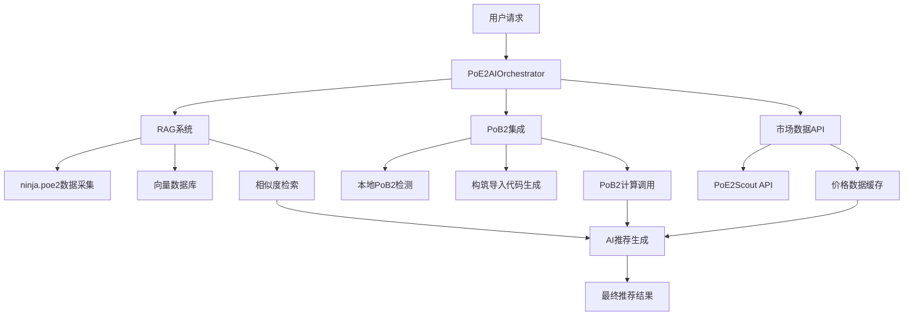

# 项目实现顺序指南

## 📋 架构完整性检查

### 当前架构依赖关系


### 核心依赖顺序
1. **基础架构层**: 数据模型 → 接口定义 → 基础提供者
2. **数据源层**: Market API → ninja.poe2 采集器 → RAG向量化
3. **PoB2集成层**: 路径检测 → 本地客户端 → 计算接口
4. **RAG智能层**: 数据采集 → 向量化 → 检索系统 → AI引擎
5. **协调层**: AI协调器 → 完整推荐流程

## 🚀 实现顺序规划

### Phase 1: 基础架构 (Foundation)
**目标**: 建立项目基础结构和核心接口
**时间**: 1-2天

#### 1.1 项目结构创建
```bash
# 创建完整目录结构
mkdir -p src/poe2build/{core,data_sources,pob2,rag,models,utils,config}
mkdir -p tests/{unit,integration,performance,e2e}
mkdir -p docs data/{cache,rag,static,samples} tools config
```

#### 1.2 基础配置文件
- `requirements.txt` - 项目依赖
- `pyproject.toml` - 现代Python配置
- `.env.example` - 环境变量模板
- `version.py` - 版本管理

#### 1.3 核心数据模型
- `src/poe2build/models/build.py` - 构筑数据模型
- `src/poe2build/models/characters.py` - 角色数据模型
- `src/poe2build/models/items.py` - 物品数据模型

#### 1.4 接口定义
- `src/poe2build/data_sources/interfaces.py` - 数据源接口
- `src/poe2build/data_sources/base_provider.py` - 基础提供者

### Phase 2: 外部数据源集成 (Data Sources)
**目标**: 集成外部API获取市场和Meta数据
**时间**: 2-3天

#### 2.1 市场数据API
- `src/poe2build/data_sources/poe2_scout.py` - PoE2Scout市场API
- 实现缓存机制和错误处理
- 测试API连通性和数据格式

#### 2.2 ninja.poe2数据采集
- `src/poe2build/data_sources/ninja_scraper.py` - poe.ninja爬虫
- `src/poe2build/rag/data_collector.py` - RAG数据采集器
- 实现异步数据采集和清洗

#### 2.3 数据存储和缓存
- `src/poe2build/utils/cache.py` - 缓存工具
- `data/samples/` - 示例数据文件
- 测试数据采集完整性

### Phase 3: PoB2集成系统 (PoB2 Integration)
**目标**: 集成本地Path of Building Community
**时间**: 3-4天

#### 3.1 PoB2检测和路径发现
- `src/poe2build/pob2/path_detector.py` - 多平台路径检测
- `src/poe2build/pob2/local_client.py` - 本地客户端接口
- 测试不同安装路径的检测

#### 3.2 PoB2数据转换
- `src/poe2build/pob2/import_export.py` - 导入导出格式转换
- `src/poe2build/pob2/calculator.py` - PoB2计算接口
- 实现构筑数据到PoB2格式的转换

#### 3.3 PoB2计算集成
- 命令行接口调用
- 计算结果解析和验证
- 错误处理和降级机制

### Phase 4: RAG智能训练系统 (RAG System)
**目标**: 构建基于ninja.poe2数据的RAG系统
**时间**: 4-5天

#### 4.1 数据向量化
- `src/poe2build/rag/vectorizer.py` - 构筑数据向量化
- 使用sentence-transformers进行文本嵌入
- 构建FAISS向量索引

#### 4.2 相似度检索系统
- `src/poe2build/rag/retrieval.py` - 相似构筑检索
- 实现快速向量搜索
- 结果排序和过滤

#### 4.3 RAG增强AI引擎
- `src/poe2build/rag/ai_enhanced.py` - RAG增强AI
- 模式识别和构筑生成
- Meta分析和洞察生成

### Phase 5: AI协调器和完整集成 (Integration)
**目标**: 集成所有组件形成完整系统
**时间**: 2-3天

#### 5.1 AI协调器实现
- `src/poe2build/core/ai_orchestrator.py` - 主要协调器
- 整合RAG、PoB2、数据源
- 实现完整推荐流程

#### 5.2 推荐引擎优化
- `src/poe2build/core/build_generator.py` - 构筑生成器
- `src/poe2build/core/recommender.py` - 推荐引擎
- 实现智能推荐算法

#### 5.3 主程序入口
- `poe2_ai_orchestrator.py` - 主程序文件
- 命令行接口和示例用法
- 系统健康检查和状态报告

### Phase 6: 测试和优化 (Testing & Optimization)
**目标**: 完善测试覆盖率和性能优化
**时间**: 2-3天

#### 6.1 单元测试
- `tests/unit/` - 每个模块的单元测试
- Mock外部依赖
- 95%代码覆盖率目标

#### 6.2 集成测试
- `tests/integration/` - 组件集成测试
- 端到端工作流测试
- 性能基准测试

#### 6.3 文档和部署
- 完善API文档
- 部署脚本和工具
- 用户使用指南

## 📝 代码生成Prompt规范

### 基础模块Prompt模板
```
请根据以下架构文档实现 [模块名称]:

**模块职责**: [具体功能描述]
**依赖项**: [依赖的其他模块]
**接口定义**: [需要实现的接口]
**核心功能**: [主要功能列表]
**错误处理**: [异常处理要求]
**测试要求**: [测试覆盖要求]

请确保:
1. 遵循项目的接口定义标准
2. 实现完整的错误处理和降级机制
3. 包含详细的文档字符串
4. 符合Python类型注解规范
5. 包含日志记录和调试信息
```

## 🔧 实施检查清单

### Phase完成标准
- [ ] **Phase 1**: 项目结构创建完成，基础配置可用
- [ ] **Phase 2**: 外部API集成完成，数据采集正常
- [ ] **Phase 3**: PoB2检测成功，计算接口可用
- [ ] **Phase 4**: RAG系统训练完成，向量检索可用
- [ ] **Phase 5**: 完整系统集成，推荐流程正常
- [ ] **Phase 6**: 测试覆盖率>90%，文档完整

### 里程碑验证
1. **基础架构验证**: `python -c "import poe2build; print('基础架构OK')"`
2. **数据源验证**: `python -c "from poe2build.data_sources import PoE2ScoutAPI; print('数据源OK')"`
3. **PoB2集成验证**: `python -c "from poe2build.pob2 import PoB2LocalClient; print('PoB2集成OK')"`
4. **RAG系统验证**: `python -c "from poe2build.rag import PoE2RAGVectorizer; print('RAG系统OK')"`
5. **完整系统验证**: `python poe2_ai_orchestrator.py`

## ⚠️ 关键风险点

### 技术风险
1. **PoB2路径检测**: 不同安装环境可能检测失败
2. **ninja.poe2 API变更**: 数据格式可能变化
3. **RAG向量计算**: 大量数据可能导致内存问题
4. **异步处理**: 并发请求可能导致API限流

### 缓解策略
1. **多路径检测**: 支持手动指定PoB2路径
2. **数据格式兼容**: 实现多版本数据格式支持
3. **内存优化**: 分批处理和向量压缩
4. **限流保护**: 智能退避和缓存机制

---

**实施建议**: 严格按照Phase顺序实施，每个Phase完成后进行集成测试，确保系统稳定性后再进入下一阶段。